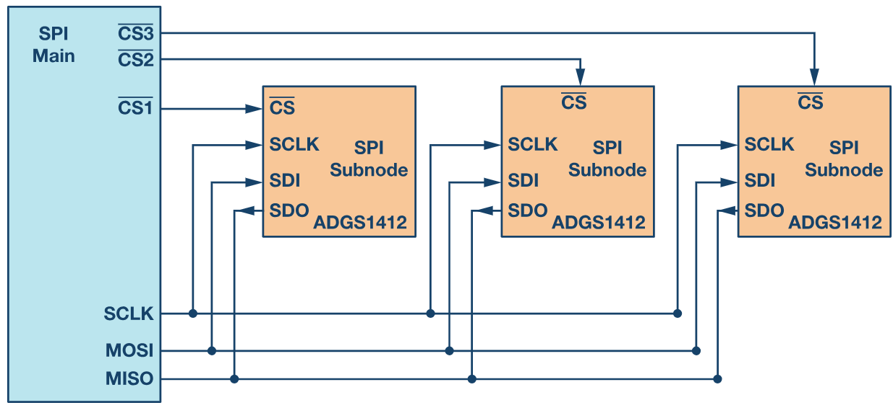
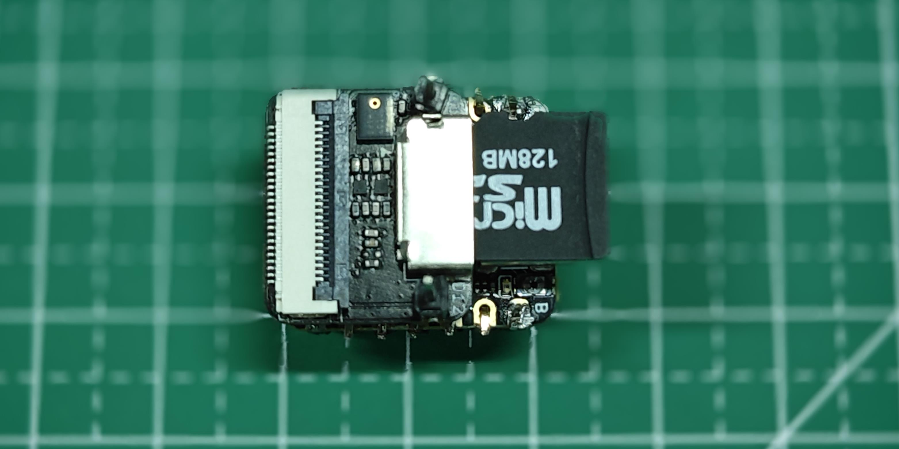
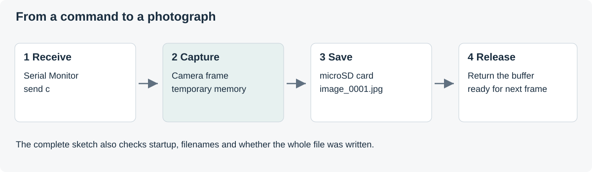

# Camera and microSD

**Misheard City · Day 1**

[Back to Arduino](../README.md) · [Reading and research task](../05_Research/README.md)

We move from controlling a light to taking a photograph. The camera captures a scene, the program holds it briefly in memory, and the microSD card stores it as a JPEG file. You trigger each photograph with a command from Serial Monitor; no Wi-Fi or trained model is needed.

## The camera and its memory

The Sense expansion board carries the camera, microphone and microSD socket. The camera's images need working memory, so select **OPI PSRAM** in Arduino IDE's Tools menu.

An **image buffer** is a region of memory holding one image. The sketch obtains a buffer, writes its contents to a file and returns the buffer to the camera driver so it can be used again.

| Step | Function in the sketch |
|---|---|
| Initialise the camera | `startCamera()` |
| Receive a command | `Serial.read()` |
| Capture and save | `capturePhoto()` |
| Obtain / release an image buffer | `esp_camera_fb_get()` / `esp_camera_fb_return()` |

You do not need to memorise the camera pin configuration; reuse the one in the supplied sketch.

[Seeed camera reference](https://wiki.seeedstudio.com/xiao_esp32s3_camera_usage/)

## Communicating with the card: SPI

The Sense board communicates with the card using **SPI**, an interface also used by displays and other peripherals.



*Several SPI devices share one bus, each with its own chip-select line. Here there is only the microSD card.*

| Signal | Purpose | Sense GPIO |
|---|---|---:|
| SCK | Clock | 7 |
| MISO | Data from the card | 8 |
| MOSI | Data to the card | 9 |
| CS | Select the card | **21** |

These connections are built into the Sense board; you do not need to wire them today.

> [!IMPORTANT]
> GPIO21 is also connected to the user LED. Replace the Blink sketch entirely. Do not add its LED routine to the camera sketch.

[Seeed microSD reference](https://wiki.seeedstudio.com/xiao_esp32s3_sense_filesystem/)

## Prepare the card



*Inserting the microSD card.*

1. Disconnect USB before inserting the card or adjusting the expansion board.
2. Use a prepared **FAT32 microSD card** of up to **32 GB**.
3. Insert it in the illustrated orientation, then reconnect USB.
4. Select **XIAO_ESP32S3**, **USB CDC On Boot: Enabled** and **PSRAM: OPI PSRAM**.

Formatting erases a card. Use the prepared workshop cards rather than formatting a card containing files you need.

## Libraries used by this sketch

Before opening the program, install **esp32 by Espressif Systems** through Arduino IDE's **Boards Manager** and select **XIAO_ESP32S3**. If you already completed the [Arduino setup](../README.md#install-the-esp32-board-package), you have installed the dependencies for this exercise.

The five `#include` lines refer to header files supplied by that board package:

| Header | What it provides | Installation for this exercise |
|---|---|---|
| `Arduino.h` | Arduino core functions and types, including `delay()`, `millis()` and serial support | Included in the ESP32 core |
| `esp_camera.h` | Camera configuration, initialisation and image-buffer functions | Camera driver included with the Arduino ESP32 package |
| `FS.h` | Filesystem and file interfaces, including `File` | Bundled ESP32 FS library |
| `SD.h` | Access to a microSD card over SPI, including `SD.begin()` and `SD.open()` | Bundled ESP32 SD library |
| `SPI.h` | SPI communication, including the `SPI` object used to connect to the card | Bundled ESP32 SPI library |

**No additional Library Manager installation is needed for these five headers in Arduino IDE with the ESP32 package.** In particular, do not install a similarly named camera or SD library for a different board.

`#include` makes declarations available during compilation; it is not an installation command. Double quotes and angle brackets affect how headers are searched for, not whether a library is bundled or needs installation. Arduino normally adds `Arduino.h` automatically when preparing an `.ino` sketch; this example includes it explicitly.

Espressif's [camera installation instructions](https://github.com/espressif/esp32-camera#arduino-ide) confirm that the camera driver needs no separate installation when using the Arduino ESP32 core in Arduino IDE. Its ESP-IDF and PlatformIO instructions are for other development environments; you do not need them.

### If a header cannot be found

For an error such as `esp_camera.h: No such file or directory`:

1. Open **Boards Manager**, search for `esp32` and confirm that **esp32 by Espressif Systems** is installed. Installing Arduino IDE alone is not sufficient.
2. Select **XIAO_ESP32S3** again. Headers bundled with a board package are resolved for the selected board, not simply because some package exists on the computer.
3. Check that the installed ESP32 package is version **2.0.17**. If the installation was interrupted or damaged, reinstall 2.0.17 and restart the IDE.
4. If the error remains, ask for help with the first error message and your settings. Do not add other libraries or copy files by hand.

If Arduino reports **multiple libraries found**, inspect the **Used** path in its output. That message alone is not necessarily an error. If it picks an unrelated copy of SD, FS or SPI from your sketchbook, ask for help before deleting any library folders.

Sources: [ESP32 core header](https://github.com/espressif/arduino-esp32/blob/master/cores/esp32/Arduino.h), [bundled libraries](https://github.com/espressif/arduino-esp32/tree/master/libraries), [camera driver](https://github.com/espressif/esp32-camera#arduino-ide).

## Capture a photograph

[Open the complete Arduino sketch](04_Camera_and_SD.ino)

### Read the program in three parts



*The command starts a capture; the image is held in memory, then written to the card.*

**1. Receive the command.** This excerpt is inside `loop()`. It calls the capture function only when the device is ready.

```cpp
char command = Serial.read();
if (command == 'c' || command == 'C') {
  if (deviceReady) {
    capturePhoto();
  }
}
```

**2. Obtain an image.** Inside `capturePhoto()`, the driver provides a frame. If none is available, the function returns without trying to save a file.

```cpp
camera_fb_t *frame = esp_camera_fb_get();
if (frame == nullptr) {
  Serial.println("No camera frame received.");
  return;
}
```

**3. Write and release it.** After checking the filename and opening the file, these lines save the bytes and release the camera memory.

```cpp
size_t expectedBytes = frame->len;
size_t writtenBytes = photo.write(frame->buf, expectedBytes);
photo.close();
esp_camera_fb_return(frame);
```

The complete sketch also initialises the camera and card, chooses unused filenames and checks that the whole file was written.

### Put it together

Open the sketch in Arduino IDE, keeping it in its matching `04_Camera_and_SD` folder. Alternatively, paste the full code below into a new sketch of that name.

<details>
<summary>Complete camera and microSD sketch</summary>


```cpp
// Misheard City — Day 1: capture a JPEG when Serial Monitor sends 'c'.
// Board: XIAO_ESP32S3 with Sense camera / microSD expansion.
// USB CDC On Boot: Enabled. PSRAM: OPI PSRAM.
// Adapted for teaching from Seeed's camera and microSD examples.
// See the source and licence notes in the accompanying README.

#include <Arduino.h>
#include "esp_camera.h"
#include "FS.h"
#include "SD.h"
#include "SPI.h"

const int SD_CS_PIN = 21;  // Shared with the user LED: no blinking here.
bool deviceReady = false;
unsigned long nextImage = 1;

bool startCamera() {
  camera_config_t config = {};
  config.ledc_channel = LEDC_CHANNEL_0;
  config.ledc_timer = LEDC_TIMER_0;

  // Fixed connections on the XIAO ESP32S3 Sense camera.
  config.pin_d0 = 15;
  config.pin_d1 = 17;
  config.pin_d2 = 18;
  config.pin_d3 = 16;
  config.pin_d4 = 14;
  config.pin_d5 = 12;
  config.pin_d6 = 11;
  config.pin_d7 = 48;
  config.pin_xclk = 10;
  config.pin_pclk = 13;
  config.pin_vsync = 38;
  config.pin_href = 47;
  config.pin_sccb_sda = 40;
  config.pin_sccb_scl = 39;
  config.pin_pwdn = -1;
  config.pin_reset = -1;

  config.xclk_freq_hz = 20000000;
  config.pixel_format = PIXFORMAT_JPEG;
  config.frame_size = FRAMESIZE_QVGA;  // 320 x 240, for a small first image.
  config.jpeg_quality = 12;           // Lower number = higher JPEG quality.
  config.fb_count = 1;
  config.fb_location = CAMERA_FB_IN_PSRAM;
  config.grab_mode = CAMERA_GRAB_WHEN_EMPTY;

  if (!psramFound()) {
    Serial.println("PSRAM unavailable. Check Tools > PSRAM.");
    return false;
  }

  esp_err_t result = esp_camera_init(&config);
  if (result != ESP_OK) {
    Serial.printf("Camera initialisation failed: 0x%x\n", result);
    return false;
  }
  return true;
}

void capturePhoto() {
  // Discard a queued frame so the next capture better reflects the new view.
  camera_fb_t *oldFrame = esp_camera_fb_get();
  if (oldFrame != nullptr) {
    esp_camera_fb_return(oldFrame);
  }
  delay(150);

  camera_fb_t *frame = esp_camera_fb_get();
  if (frame == nullptr) {
    Serial.println("No camera frame received.");
    return;
  }

  char filename[40];
  do {
    snprintf(filename, sizeof(filename), "/image_%04lu.jpg", nextImage++);
  } while (SD.exists(filename));  // Do not overwrite earlier photographs.

  File photo = SD.open(filename, FILE_WRITE);
  if (!photo) {
    Serial.println("Could not open a new image file.");
    esp_camera_fb_return(frame);
    return;
  }

  size_t expectedBytes = frame->len;
  size_t writtenBytes = photo.write(frame->buf, expectedBytes);
  photo.close();
  esp_camera_fb_return(frame);   // Release the camera buffer.

  if (writtenBytes != expectedBytes) {
    Serial.printf("Incomplete file: %s (%u of %u bytes).\n",
                  filename,
                  (unsigned int)writtenBytes,
                  (unsigned int)expectedBytes);
    Serial.println("Record this filename as incomplete; check the card.");
    return;
  }

  Serial.printf("Saved %s (%u bytes).\n",
                filename, (unsigned int)writtenBytes);
}

void setup() {
  Serial.begin(115200);
  // Give USB serial a moment to connect without waiting forever.
  unsigned long waitStarted = millis();
  while (!Serial && millis() - waitStarted < 3000) {
    delay(10);
  }

  Serial.println("Misheard City: camera to microSD");

  if (!startCamera()) {
    Serial.println("Resolve the camera issue, then press RESET.");
    return;
  }

  SPI.begin(7, 8, 9, SD_CS_PIN);  // SCK, MISO, MOSI, CS.
  if (!SD.begin(SD_CS_PIN) || SD.cardType() == CARD_NONE) {
    Serial.println("SD card unavailable. Check the card and its format.");
    Serial.println("Disconnect power before adjusting the card.");
    return;
  }

  delay(1000);
  deviceReady = true;
  Serial.println("Ready. Send c to capture a photograph.");
}

void loop() {
  if (Serial.available() > 0) {
    char command = Serial.read();

    if (command == 'c' || command == 'C') {
      if (deviceReady) {
        capturePhoto();
      } else {
        Serial.println("Device not ready. Read the setup messages.");
      }
    }
  }
  delay(10);
}
```

</details>

### Upload and observe

1. Upload the sketch and open **Serial Monitor at 115200 baud**.
2. Press RESET if you missed the startup messages.
3. Wait for **Ready**.
4. Point the camera at a surface or object and hold it still.
5. Type **c** and send it.
6. Read the saved filename. Move the camera and repeat.

The sketch chooses an unused filename, so photographs already on the card are not overwritten. A filename records sequence, **not a date or location**. This exercise does not use GPS or a real-time clock; record context separately.

## Retrieve the photographs

After the final save message, disconnect USB. Remove the card, use the card reader and copy the JPEGs into your group's folder.

Open the files. Compare what you saw in front of the camera with what the photographs show.

The starting resolution is **QVGA: 320 × 240 pixels**. Once capture works, you can change `FRAMESIZE_QVGA` to `FRAMESIZE_VGA` for 640 × 480 and compare detail and file size. Change one setting at a time.

## A six-image exercise

Choose one subject: a plant, a worn surface, some cables or an object near a window. For this first exercise, keep identifiable people out of the frame.

Capture:

- Two views from different distances.
- Two views with a different angle or background.
- Two views under different available lighting.

| Filename | Subject | Framing / distance | Light / background | Observation |
|---|---|---|---|---|
| | | | | |

Choose two photographs of the same subject that look noticeably different, and explain one detail that became clearer or disappeared.

These photographs are observations, not yet a training dataset. They show how framing, background and light change what the camera records.

## Troubleshooting

| Symptom | First thing to inspect |
|---|---|
| `PSRAM unavailable` | Enable OPI PSRAM and upload again |
| Camera initialisation fails | Note the error code and disconnect power before anyone checks the camera connection |
| Card unavailable | Card orientation, FAT32 preparation, CS on GPIO21 and no LED routine |
| Missing header / `No such file or directory` | Follow the [dependency instructions](#if-a-header-cannot-be-found); the five headers come with the ESP32 package |
| Camera configuration error | Record the exact error and ESP32 package version; a missing configuration field is different from a missing library |
| No serial messages | USB CDC setting, correct port and Serial Monitor; press RESET |
| Incomplete JPEG | Available card space, card condition and whether power was removed during writing |
| Dark or blurred photograph | Lighting, stability and distance before changing code |

## Sources

The camera and storage workflow draws on [Seeed camera usage](https://wiki.seeedstudio.com/xiao_esp32s3_camera_usage/) and [Sense microSD](https://wiki.seeedstudio.com/xiao_esp32s3_sense_filesystem/), with the [Espressif camera interface](https://github.com/espressif/esp32-camera/blob/master/driver/include/esp_camera.h) as the API reference. The workshop version adds a serial trigger, unused filenames, readiness messages and write-length reporting.

The SPI image is reproduced from [Pervasive Urbanism: Day 2 Sensors and Actuators](https://github.com/PervasiveUrbanism/PervasiveUrbanism_25-26/tree/main/Skills%20Module%202%20Prosthetic%20Clouds/Skills%202%20-%20Day%202%20Sensors%20and%20Actuators), with permission obtained by the instructor. Original image rights remain with their respective creators.

The card photograph is reproduced unchanged from Seeed Studio under [CC BY-SA 4.0](https://creativecommons.org/licenses/by-sa/4.0/); see [Seeed's licence page](https://wiki.seeedstudio.com/License/).

<details>
<summary>Original licence for the Seeed example code</summary>

```text
MIT License

Copyright (c) 2008-2016 Seeed Development Limited (www.seeedstudio.com / www.seeed.cc)

Permission is hereby granted, free of charge, to any person obtaining a copy
of this software and associated documentation files (the "Software"), to deal
in the Software without restriction, including without limitation the rights
to use, copy, modify, merge, publish, distribute, sublicense, and/or sell
copies of the Software, and to permit persons to whom the Software is
furnished to do so, subject to the following conditions:

The above copyright notice and this permission notice shall be included in all
copies or substantial portions of the Software.

THE SOFTWARE IS PROVIDED "AS IS", WITHOUT WARRANTY OF ANY KIND, EXPRESS OR
IMPLIED, INCLUDING BUT NOT LIMITED TO THE WARRANTIES OF MERCHANTABILITY,
FITNESS FOR A PARTICULAR PURPOSE AND NONINFRINGEMENT. IN NO EVENT SHALL THE
AUTHORS OR COPYRIGHT HOLDERS BE LIABLE FOR ANY CLAIM, DAMAGES OR OTHER
LIABILITY, WHETHER IN AN ACTION OF CONTRACT, TORT OR OTHERWISE, ARISING FROM,
OUT OF OR IN CONNECTION WITH THE SOFTWARE OR THE USE OR OTHER DEALINGS IN THE
SOFTWARE.
```

</details>

[Continue to reading and the research task](../05_Research/README.md)
