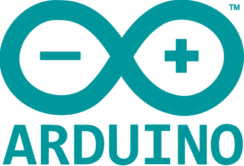
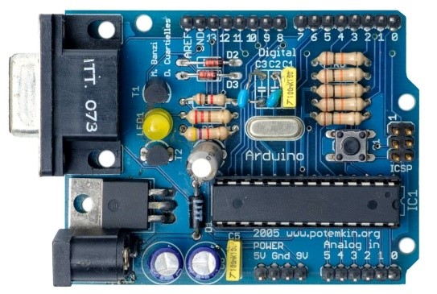
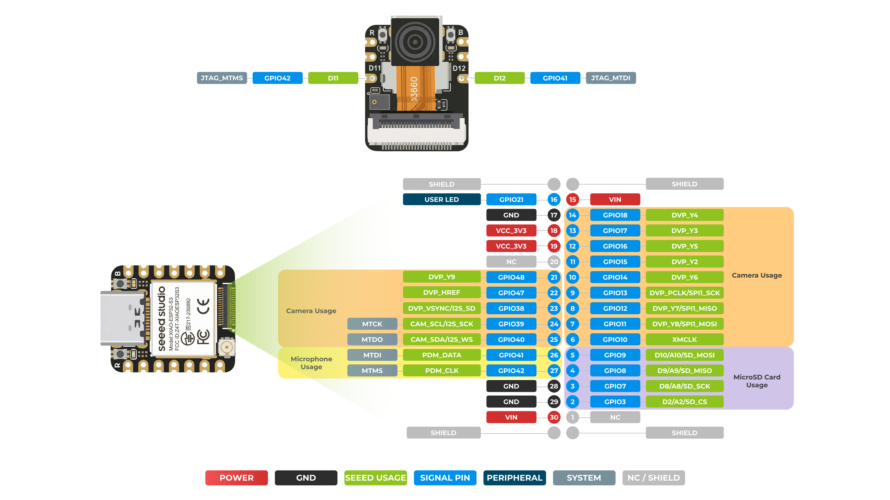
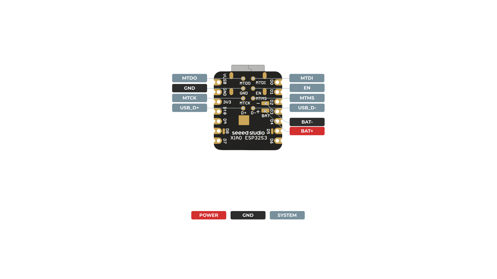
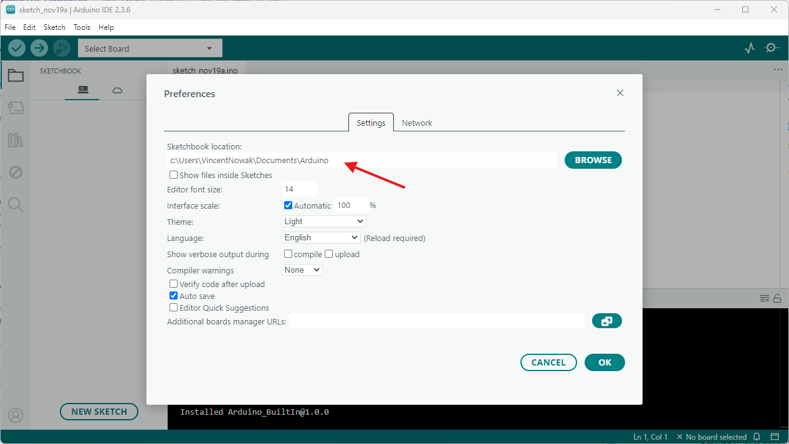
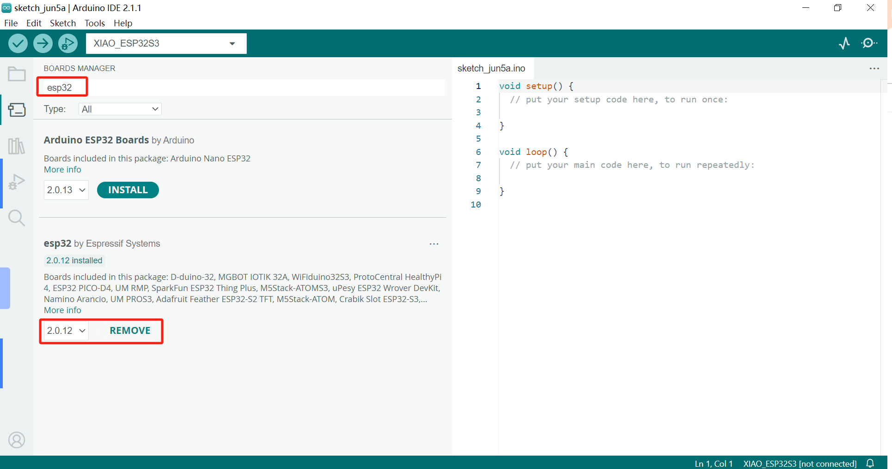
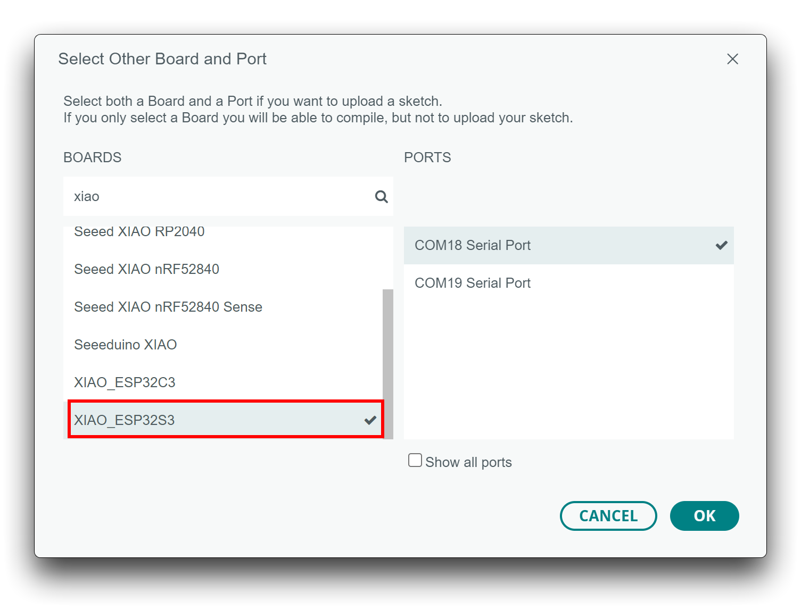
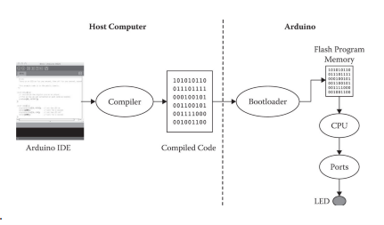

# Introduction to Arduino
## Misheard City: Day 1

**Tuesday 6 October · Kunpeng Lei**

[Workshop homepage](../README.md) · [Our board](#our-board) · [Installation](#installation) · [AI-assisted programming](#ai-assisted-programming) · [Camera practical](04_Camera_and_SD/README.md) · [Research task](05_Research/README.md)

Today we get to know the device for our urban enquiry: we upload and change a program, communicate with the board and take photographs. Later, the same board will run a model trained on your group's own categories.

**You need:** a laptop, Arduino IDE, a USB-C data cable, a XIAO ESP32S3 Sense, a prepared microSD card and a card reader. No soldering or external sensor wiring is required today.

---

## Opening tutorial: interests and observations

Show a photograph or describe a place you would like to investigate: one detail you notice there and one thing you would like to understand better. These interests are the starting point for your categories.

## What is Arduino, and where does it come from?

**Arduino** is an open-source electronics platform for creating interactive projects. It brings together **hardware**, the physical board and connected components, and **software**, the instructions that make them work.

Arduino grew out of interaction-design education in Ivrea, Italy. It made microcontrollers more accessible to designers, artists and students who wanted to experiment with physical objects and environments.


*The Arduino bar in Ivrea, where the project got its name.*



*An early Arduino prototype.*

Because the platform is open, you can learn from existing examples, adapt them and share the result. We work this way throughout the workshop.

[Arduino website](https://www.arduino.cc/) · [What is Arduino?](https://docs.arduino.cc/learn/starting-guide/whats-arduino/)

## What can Arduino do?

A programmable board can **sense** something, process the information and produce an **output**. For example:

- A light sensor changes the brightness of an LED.
- A temperature sensor produces a record over time.
- A motor responds to a button.
- A camera captures an image and saves it to a card.
- A trained model produces category scores from a camera image.

The last two examples are central to this workshop. Our Venice device linked visual classifications to a responsive soundscape; your group will link its own urban question to observations and a film.

### Microcontrollers and computers

A **microcontroller** combines a processor, memory and connections to other components. A **development board** makes the chip easier to power, program and connect.

| Your laptop | Our XIAO board |
|---|---|
| Edit and compile a program | Run the uploaded program |
| Prepare datasets and work with training tools | Capture images and later run a small trained model |
| View images, analyse records and edit a film | Save images and measurements |
| Has a desktop interface | Communicates through USB, connected components or a network |

Uploading installs the program in the board's flash memory. Once programmed, the board can run from a USB power supply without the laptop.

Different microcontrollers have different software environments. On the ESP32, Arduino runs on top of a real-time operating system, but we only need the simple `setup()` and `loop()` structure.

## The Arduino language and ecosystem

We write **C++ using the Arduino framework**. Its functions make common tasks approachable: `digitalWrite()` changes a pin's electrical level; `Serial.println()` sends a line of text.

A program is called a **sketch**. We write it in the **Arduino IDE**, the application that compiles and uploads it.

| Name | What it means here |
|---|---|
| Arduino IDE | The application on your computer |
| Arduino framework | The functions and conventions used in the sketch |
| Board package | The tools and definitions needed to build for a particular board |
| Library | Reusable code for a camera, sensor or other task |
| Firmware | The program installed on the board |

Many manufacturers make Arduino-compatible boards, including Seeed Studio, Adafruit and SparkFun. Their pin assignments, memory and electrical requirements differ. An example written for an Uno often needs changes before it can run on a XIAO.

Python will be introduced later for datasets and analysis. Today's device programs use Arduino C++.

---

# Our Board

## Seeed Studio XIAO ESP32S3 Sense


We use the **XIAO ESP32S3 Sense**, a small board with a camera, microphone and microSD interface. The **base board** contains the ESP32-S3 processor; the **Sense expansion board** provides the camera and recording interfaces.

[Seeed Studio: Getting Started](https://wiki.seeedstudio.com/xiao_esp32s3_getting_started/)

### Core specifications

| Feature | Specification / use |
|---|---|
| Processor | ESP32-S3, dual-core, up to 240 MHz |
| Flash | 8 MB: stores the firmware and, later, the deployed model |
| PSRAM | 8 MB: additional working memory for images and other data |
| Base-board dimensions | Approximately 21 × 17.8 mm |
| USB-C | Power, programming and serial communication |
| GPIO logic | **3.3 V** |
| Connectivity | Wi-Fi and Bluetooth LE |
| Sense expansion | Camera, digital microphone and microSD socket |

The camera module can differ between production versions. Check which one your kit has; older tutorials may show a different one.

### Pins, power and buttons



*Front pinout of the XIAO ESP32S3 Sense.*

Find the **USB-C socket**, **BOOT**, **RESET**, **GND**, **3V3** and **user LED**.

A **GPIO** is a general-purpose input/output connection. The board's printed labels and processor GPIO numbers are not always the same: **D0 corresponds to GPIO1**. A bare pin number in our ESP32 code refers to the GPIO number.

- **RESET** restarts the installed program.
- **BOOT** helps place the board in download mode if uploading fails.
- **GND** is the common electrical reference.
- **3V3** is the regulated 3.3 V supply.

> [!IMPORTANT]
> USB supplies 5 V power, but GPIO signals use **3.3 V**. Do not connect a 5 V signal directly to a GPIO. External sensor wiring and soldering come in a later session.

### Camera, microphone and microSD



*The Sense expansion board. The camera and microphone already use some of the board's connections.*

The Sense SD interface uses:

| Connection | GPIO |
|---|---:|
| SCK (clock) | 7 |
| MISO (data from the card) | 8 |
| MOSI (data to the card) | 9 |
| CS (chip select) | **21** |

For SD chip select, follow the [Sense filesystem instructions](https://wiki.seeedstudio.com/xiao_esp32s3_sense_filesystem/), which specify `SD.begin(21)`. Some reference drawings show a different CS label.

> [!IMPORTANT]
> The built-in user LED also uses **GPIO21**. Finish the LED exercises before using the card. The camera practical replaces the LED program; do not combine SD access with a blinking routine.

### Memory and files

**Flash** keeps the program when power is disconnected. **RAM and PSRAM** hold temporary working data, which is lost when power is removed. The **microSD card** holds files deliberately saved by the program.

A photograph first exists only in memory; saving it to the card is a separate step.

---

# Installation

Download **Arduino IDE 2** from the [official Arduino software page](https://www.arduino.cc/en/software).

## Working folder

Use a folder you can find again, such as `Misheard_City/Group_01`. Arduino's **Sketchbook location** can be set in Preferences.



*The sketchbook location in Preferences. Choose your own folder.*

Keep each sketch inside a folder with the same name:

`01_Blink/01_Blink.ino`

Save your group's variations separately so you can return to the supplied example.

## Install the ESP32 board package

1. Open **Preferences** (`File → Preferences` on Windows; the Arduino application menu on macOS).
2. Add this address to **Additional Boards Manager URLs**, keeping any existing entries:

```text
https://raw.githubusercontent.com/espressif/arduino-esp32/gh-pages/package_esp32_index.json
```

3. Open **Boards Manager** and search for `esp32`.
4. Install **esp32 by Espressif Systems**, choosing version **2.0.17** from the version list. Keep this version for all workshop examples; other versions may need changes to the code.



*The ESP32 package in Boards Manager. Install 2.0.17, not the version shown.*

## Board packages, libraries and header files

A line such as `#include "SD.h"` makes a **header file** available to the sketch. A header declares functions and types that the program can use. The `.h` extension does **not** mean that a separate installation is required, and `#include` does not download anything.

There are two installation routes in Arduino IDE:

| What you need | Where to install it | Example |
|---|---|---|
| Support for a family of boards, including its core and bundled libraries | **Boards Manager** | **esp32 by Espressif Systems** |
| An additional library for a particular device or task | **Library Manager** | A sensor library specified in a later practical |

**For Day 1, the ESP32 board package supplies all the components used by our examples.** Install that package and select **XIAO_ESP32S3**. You do not need separate Library Manager installations for `Arduino.h`, `esp_camera.h`, `FS.h`, `SD.h` or `SPI.h`.

For a future exercise that specifies an additional library, open **Tools → Manage Libraries…** (or the Library Manager sidebar), search for its exact name, check the author and install the version specified by the lesson. Use **Sketch → Include Library → Add .ZIP Library…** only when the exercise supplies a library ZIP. Do not download individual `.h` files into the sketch folder as a substitute for installing a library.

In the camera practical, a [dependency table](04_Camera_and_SD/README.md#libraries-used-by-this-sketch) explains what each included header provides.

References: [Espressif installation guide](https://docs.espressif.com/projects/arduino-esp32/en/latest/installing.html), [bundled ESP32 libraries](https://github.com/espressif/arduino-esp32/tree/master/libraries), and [camera driver installation for Arduino IDE](https://github.com/espressif/esp32-camera#arduino-ide).

## Connect and select the board

Connect the XIAO with a **USB data cable**. A charging-only cable may power the board without allowing programming.

Select **XIAO_ESP32S3** and the connected **port**.



*Board selection. The Sense version also uses XIAO_ESP32S3.*

The **board** tells the IDE what to compile for. The **port** identifies the connected device. On Windows it may look like `COM5`; on macOS it may contain `usbmodem`. Reconnecting the board can help identify the correct entry.

### Settings

| Setting | Selection |
|---|---|
| Board | XIAO_ESP32S3 |
| USB CDC On Boot | Enabled |
| PSRAM | OPI PSRAM, for the camera practical |
| Serial Monitor | 115200 baud |
| Other settings | Board defaults |

Record the Arduino IDE version and ESP32 package version in your group notes. Menu labels can vary between releases.

If the port is missing or uploading fails, disconnect USB, hold **BOOT**, reconnect USB and release BOOT. Select the port again and upload. Press RESET afterwards if needed. See [Seeed's recovery instructions](https://wiki.seeedstudio.com/xiao_esp32s3_getting_started/#bootloader-mode).

---

# Coding in Arduino (C/C++)

Each exercise introduces one concept at a time, using the XIAO's LED and USB serial connection.

A program (called a *sketch*) usually has this structure:

1. **Libraries:** extra code you include, for example for the camera or the SD card.
2. **Variables and constants:** names for the numbers, pins and settings the sketch uses.
3. **`setup()`:** runs once when the board starts or is reset.
4. **`loop()`:** repeats for as long as the board is running.
5. **Functions:** named blocks of code that you can reuse.

```cpp
void setup() {
  // Prepare the board.
}

void loop() {
  // Repeat an action.
}
```

`//` introduces a comment, `{ }` groups instructions, and `;` ends most instructions.



*The IDE compiles your sketch and uploads it to the board.*

**Verify** compiles the sketch. **Upload** compiles it and sends it to the board. Uploading a new sketch replaces the previous program.

[Arduino language reference](https://docs.arduino.cc/language-reference/)

**Start with 001 and 002**, then continue to [AI-assisted programming](#ai-assisted-programming) and the [camera exercise](04_Camera_and_SD/README.md). Examples 003–005 explain functions, conditions and repetition; 006–008 are further practice.

A fragment marked as a replacement goes inside the existing program; a complete sketch replaces the previous one.

---

## 001 - Basic LED Blink

[Open the complete sketch](01_Blink/01_Blink.ino)

The built-in **user LED is active-low**: `LOW` switches it on and `HIGH` switches it off. With XIAO_ESP32S3 selected, `LED_BUILTIN` refers to its user LED on GPIO21.

```cpp
// MISHEARD CITY | Practical 1 | 01 - Blink
// Board: Seeed Studio XIAO ESP32S3 Sense.
// The built-in user LED is active-low: LOW = on, HIGH = off.

const int ledPin = LED_BUILTIN;
int onTimeMs = 300;
int offTimeMs = 700;

void setup() {
  pinMode(ledPin, OUTPUT);
  digitalWrite(ledPin, HIGH);  // Start with the user LED off.
}

void loop() {
  digitalWrite(ledPin, LOW);   // Turn the user LED on.
  delay(onTimeMs);
  digitalWrite(ledPin, HIGH);  // Turn the user LED off.
  delay(offTimeMs);
}
```

Upload, then find the blinking user LED (not the separate charging light).

The original timing is **300 ms on and 700 ms off**: approximately one second per cycle.

**Try:** change the timings to 100 and 900. The overall cycle stays the same, but the illuminated part becomes shorter. Predict the difference before uploading.

- `pinMode()` configures an output.
- `digitalWrite()` changes its level.
- `delay()` waits for a duration in milliseconds.

## 002 - Variables and serial feedback

[Open the complete sketch](02_Blink_and_Serial/02_Blink_and_Serial.ino)

A **variable** holds a value that can change. A **constant** is not reassigned. Names such as `onTimeMs` also communicate the unit.

| Type | Example | Use |
|---|---|---|
| `bool` | `true`, `false` | A state or condition |
| `char` | `'c'` | One character |
| `int` | `300` | A whole number |
| `unsigned long` | `cycleCount` | A non-negative counter or time value |
| `float` | `0.72f` | A decimal value |

This version reports each cycle to the computer with three additions:

```cpp
// Above setup(): a value we will update.
unsigned long cycleCount = 0;
```

```cpp
// Inside setup(): start the USB serial connection.
Serial.begin(115200);
```

```cpp
// Inside loop(): update and report the counter.
cycleCount = cycleCount + 1;
Serial.print("cycle=");
Serial.println(cycleCount);
```
```cpp
// MISHEARD CITY | Practical 1 | 02 - Blink with variables and serial feedback
// Board: Seeed Studio XIAO ESP32S3 Sense.
// Arduino IDE: USB CDC On Boot = Enabled; Serial Monitor = 115200.
// Serial Monitor output is live text, not a saved data file.

const int ledPin = LED_BUILTIN;
const char groupName[] = "GROUP_01";
int onTimeMs = 300;
int offTimeMs = 700;
unsigned long cycleCount = 0;

void setup() {
  pinMode(ledPin, OUTPUT);
  digitalWrite(ledPin, HIGH);
  Serial.begin(115200);
  delay(1000);  // Brief startup pause; does not wait forever for a computer.
}

void loop() {
  cycleCount = cycleCount + 1;
  Serial.print("group=");
  Serial.print(groupName);
  Serial.print(", cycle=");
  Serial.print(cycleCount);
  Serial.print(", on_ms=");
  Serial.print(onTimeMs);
  Serial.print(", off_ms=");
  Serial.println(offTimeMs);

  digitalWrite(ledPin, LOW);
  delay(onTimeMs);
  digitalWrite(ledPin, HIGH);
  delay(offTimeMs);
}
```

Open **Serial Monitor** and choose **115200 baud**. Change `GROUP_01` to your group's name.

`Serial.print()` continues the current line; `Serial.println()` ends it. The messages show the settings used by the sketch. They are **live text**, not a file automatically saved to the SD card.

**Try:** change a timing value and compare the printed message with the light. Press RESET and observe the counter restarting. The count was held in working memory.

<details>
<summary>003–005: functions, conditions and repetition</summary>

## 003 - Blink using a function

A **function** gives an action a name. This complete example alternates between a short pulse and a long one. Copy it into a new sketch.

```cpp
const int ledPin = LED_BUILTIN;

void flash(unsigned long periodMs) {
  digitalWrite(ledPin, LOW);
  delay(periodMs);
  digitalWrite(ledPin, HIGH);
  delay(periodMs);
}

void setup() {
  pinMode(ledPin, OUTPUT);
  digitalWrite(ledPin, HIGH);
}

void loop() {
  flash(100);
  flash(500);
}
```

`flash(100)` calls the function with a 100 ms duration for both its on and off parts. The function keeps this action in one place.

**Try:** describe the sequence before uploading, then swap the two calls. Keep this sketch for the next examples.

## 004 - Control structure: `if`

An `if` statement chooses an action according to a condition.

In example 003, add this variable **above `setup()`**:

```cpp
bool fast = false;
```

Then **replace its `loop()`** with:

```cpp
void loop() {
  if (fast == true) {
    flash(100);
  } else {
    flash(500);
  }
}
```

Keep the existing `flash()` and `setup()`. Do not add a second `loop()`.

**Try:** change `fast` to `true` and upload again. `=` assigns a value; `==` compares two values.

## 005 - Repetition with `for`

A `for` loop repeats an action a specified number of times.

Using the function from example 003, **replace `loop()`** with:

```cpp
void loop() {
  for (int i = 0; i < 3; i++) {
    flash(100);
  }
  delay(1000);
}
```

The counter begins at 0, continues while it is below 3, and increases after each repetition. This produces three pulses followed by a pause.

**Try:** change the number of pulses. Explain the difference between the finite `for` loop and Arduino's continually repeated `loop()`.

### Put 003–005 together

This complete example combines the function, condition and repetition. The `fast` variable selects the pulse duration; the `for` loop produces three pulses, followed by a pause. Replace the previous sketch with this version rather than appending another `setup()` or `loop()`.

```cpp
const int ledPin = LED_BUILTIN;
bool fast = false;

void flash(unsigned long periodMs) {
  digitalWrite(ledPin, LOW);
  delay(periodMs);
  digitalWrite(ledPin, HIGH);
  delay(periodMs);
}

void setup() {
  pinMode(ledPin, OUTPUT);
  digitalWrite(ledPin, HIGH);
}

void loop() {
  for (int i = 0; i < 3; i++) {
    if (fast) {
      flash(100);
    } else {
      flash(500);
    }
  }
  delay(1000);
}
```

Trace one pass through `loop()` together. Then change either `fast` or the number of repetitions and explain which part of the behaviour should change.

---

</details>

# AI-Assisted Programming

Use the blink or pulse sketch you have just observed. Decide on one change, describe it clearly and compare the result with your intention.

For example, create **two short pulses, one longer pulse and a pause**.

> I am using Arduino C++ with a Seeed Studio XIAO ESP32S3 Sense. Its built-in user LED is GPIO21 and active-low. This exercise does not use the SD card or external components.
>
> Here is our current sketch: [paste the code].
>
> Change the rhythm to two short pulses, one longer pulse and a pause. Keep the pin assignment and use the functions already introduced. Explain the timing, identify the changed lines and provide the complete revised sketch. Explain any assumptions.

Read the changed lines together before uploading.

Keep a short record:

| Intended change | Changed code | Observed behaviour | Next revision |
|---|---|---|---|
| | | | |

If something fails, give the assistant the exact error, board selection and package version. Ask for a small correction rather than replacing the whole program immediately.

Always test a suggestion on the board: an explanation from AI does not prove that the code works.

**Next:** [Camera and microSD practical](04_Camera_and_SD/README.md). This uses a separate program and replaces the LED sketch.

---

# Further Coding Examples

Further practice for later. You do not need these before the camera exercise.

## 006 - Loops with arrays

An **array** stores several values under one name. Its first index is zero.

Starting with example 003, add this array above `setup()`:

```cpp
unsigned long durationsMs[] = {100, 100, 500};
```

Replace `loop()` with:

```cpp
void loop() {
  for (int i = 0; i < 3; i++) {
    flash(durationsMs[i]);
  }
  delay(1000);
}
```

Keep the existing `flash()` function. Entries 0, 1 and 2 hold the three durations. If you change the number of entries, also change the loop bound.

## 007 - Communicating via Serial Monitor

[Open the complete serial-control sketch](03_Serial_Control_Optional/03_Serial_Control_Optional.ino)

You can send a command from the computer to control the light.

```cpp
// MISHEARD CITY | Practical 1 | 03 - Serial control (optional)
// Board: Seeed Studio XIAO ESP32S3 Sense.
// Arduino IDE: USB CDC On Boot = Enabled; Serial Monitor = 115200.
// Send 1 for on, 0 for off. Newline/carriage-return characters are ignored.

const int ledPin = LED_BUILTIN;

void setup() {
  pinMode(ledPin, OUTPUT);
  digitalWrite(ledPin, HIGH);
  Serial.begin(115200);
  delay(1000);
  Serial.println("Send 1 for LED on; send 0 for LED off.");
}

void loop() {
  if (Serial.available() > 0) {
    char command = Serial.read();

    if (command == '1') {
      digitalWrite(ledPin, LOW);
      Serial.println("User LED: ON");
    } else if (command == '0') {
      digitalWrite(ledPin, HIGH);
      Serial.println("User LED: OFF");
    } else if (command != '\n' && command != '\r') {
      Serial.println("Unknown command. Send 1 or 0.");
    }
  }
}
```

Open Serial Monitor at 115200 baud. Send **1** to switch the LED on and **0** to switch it off.

`Serial.available()` indicates that data is waiting; `Serial.read()` receives one character. `'1'` is a character, not the numerical value `1`.

Use this as a separate sketch. GPIO21 cannot simultaneously serve as our manually controlled LED and the SD chip-select signal.

## 008 - Sending and receiving messages

A **String** can hold several characters. This complete sketch collects characters until you send a newline, then echoes the message.

```cpp
String message = "";

void setup() {
  Serial.begin(115200);
}

void loop() {
  while (Serial.available() > 0) {
    char incoming = Serial.read();

    if (incoming == '\n') {
      Serial.print("You typed: ");
      Serial.println(message);
      message = "";
    } else if (incoming != '\r') {
      if (message.length() < 80) {
        message += incoming;
      }
    }
  }
}
```

Set Serial Monitor to **115200 baud** and **Newline**, type a short message and send it. This example limits stored text to 80 characters so a missing newline cannot grow the message indefinitely.

---

## Bring to the next tutorial

Show two camera photographs that made you notice a difference in framing, light or distance. Together, prepare the short [research task](05_Research/README.md): an urban interest, a passage from one reading, and two or three provisional categories with an ambiguous example.

Save the sketch that worked on your board and one sentence explaining your change.

## If something does not work

| Symptom | First thing to check |
|---|---|
| No port appears | A data-capable cable, the USB connection and BOOT recovery |
| Upload cannot connect | XIAO_ESP32S3 selection, correct port and any other app using it |
| Two `setup()` or `loop()` definitions | Replace the previous example rather than appending another complete sketch |
| No serial output | USB CDC On Boot enabled, the running port selected and monitor open; press RESET |
| Unreadable serial text | 115200 baud |
| LED seems inverted | The XIAO user LED is active-low |
| Camera or SD issue | Follow the [camera troubleshooting notes](04_Camera_and_SD/README.md#troubleshooting) |

Keep the error message and current sketch when asking for help.

## Sources and image credits

The organisation, background material, introductory illustrations and numbered exercise sequence are adapted from [Pervasive Urbanism 2025–26 — Day 1 Arduino Coding](https://github.com/PervasiveUrbanism/PervasiveUrbanism_25-26/tree/main/Skills%20Module%202%20Prosthetic%20Clouds/Skills%202%20-%20Day%201%20Arduino%20Coding), reused with permission obtained by the workshop instructor. The Arduino logo, Ivrea photograph, early prototype photograph, Preferences screenshot and compilation diagram come from that course's image folder; original rights remain with their respective creators.

The board photographs, pin diagrams and ESP32 setup screenshots come from [Seeed Studio's XIAO ESP32S3 guide](https://wiki.seeedstudio.com/xiao_esp32s3_getting_started/), reproduced unchanged under [CC BY-SA 4.0](https://creativecommons.org/licenses/by-sa/4.0/), according to [Seeed's licence page](https://wiki.seeedstudio.com/License/). Hardware-specific explanations and exercises have been adapted for the XIAO ESP32S3 Sense.

[Continue to Camera and microSD](04_Camera_and_SD/README.md) · [Reading and research task](05_Research/README.md)
