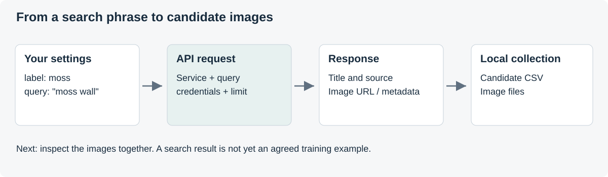

# Image Search 1 — Openverse

**Misheard City · Day 2**

[Back to Day 2](../README.md) · [Google Images](../01b_Google_Images/README.md) · [Dataset review](../02_Dataset_Review/README.md)

The notebook turns search phrases into a table of **candidate images**, each with its creator, source page and licence. Openverse images are used **for training and in the film**.

[Open the notebook](01a_Openverse.ipynb) · [Open in Colab](https://colab.research.google.com/github/25217148/Misheard-City/blob/main/Day_02_Datasets_and_Training/01a_Openverse/01a_Openverse.ipynb)

- [Part A — Register once](#part-a--register-once)
- [Part B — Collect images step by step](#part-b--collect-images-step-by-step)
- [Part C — Complete script](#part-c--complete-script)

---

## What is an API?

An **API** (Application Programming Interface) lets one program ask another for data.

| Step | In the notebook |
|---|---|
| Send a request with parameters | `requests.get(".../v1/images/", params=...)` |
| Receive a JSON response | `response.json()` |
| Read the fields | `result["creator"]`, `result["license"]`… |
| Collect them in a table | `pandas.DataFrame` → `candidates_openverse.csv` |

## Openverse

[Openverse](https://openverse.org/) is a search engine for openly licensed images and public-domain works, collected from sources such as Flickr and Wikimedia Commons. Every result comes with its **creator**, **source page** and **licence**.

🔗 [Openverse API documentation](https://api.openverse.org/v1/) · [Terms of Service](https://docs.openverse.org/terms_of_service.html)

| | Anonymous | Registered |
|---|---|---|
| Results per page | up to 20 | up to 50 |
| Requests | low limit per network address | higher limit per application |
| Results per search phrase | at most 240 | at most 240 |

> [!NOTE]
> Openverse's Terms of Service do not allow scraping. The notebook uses the API with a few phrases and one page per phrase.

---

## Part A — Register once

Registration gives an application its own credentials and higher limits.

### 1. Register

The cell runs once, with `REGISTER = True`.

- `APP_NAME`: unique across all Openverse users, e.g. with the group number.
- `DESCRIPTION`: what the API is used for.
- `EMAIL`: an address you can open now.

```python
# SET-UP · registers the application with Openverse (run once)
# ---- Fill in, set REGISTER = True, run once --------------------------------
REGISTER = False
APP_NAME = "Misheard City Group 01 (UCL B-Pro workshop)"
DESCRIPTION = ("UCL Bartlett student workshop. We search openly licensed photographs "
               "of urban surfaces to build a small image-classification dataset "
               "for teaching and research.")
EMAIL = "your.name@ucl.ac.uk"
# ---------------------------------------------------------------------------

import requests

if REGISTER:
    response = requests.post(
        "https://api.openverse.org/v1/auth_tokens/register/",
        json={"name": APP_NAME, "description": DESCRIPTION, "email": EMAIL},
        timeout=30,
    )
    if response.status_code == 201:
        app = response.json()
        print("Registered:", app["name"])
        print("OPENVERSE_CLIENT_ID     =", app["client_id"])
        print("OPENVERSE_CLIENT_SECRET =", app["client_secret"])
        print("Copy both values now. They are shown only once.")
    else:
        print("Registration failed:", response.status_code)
        print(response.text)
else:
    print("REGISTER is False: nothing was sent.")
```

The response contains a `client_id` and a `client_secret`. **Both are shown only once.** After copying them, set `REGISTER = False` and clear the cell output. Lost credentials need a new registration with a new `APP_NAME`.

### 2. Save the credentials

**Colab:** the **key icon** (Secrets) in the left sidebar holds:

| Name | Value |
|---|---|
| `OPENVERSE_CLIENT_ID` | your client ID |
| `OPENVERSE_CLIENT_SECRET` | your client secret |

with **Notebook access** on for both.

**VS Code:** environment variables, see [VS Code on your own computer](../README.md#vs-code-on-your-own-computer).

> [!IMPORTANT]
> The client secret is a password. It never goes into a cell, a README, a screenshot or a chat.

### 3. Verify your email

Openverse sends a verification link to `EMAIL`. Until it is clicked, requests have anonymous limits; the link works once, and a second visit shows `Invalid verification code`.

### 4. Check

The cell requests an **access token** and the status of the key. A working key prints `Email verified: True`.

```python
# SET-UP · checks the credentials and the email verification
import os
import requests


def read_secret(name):
    """Read a value from Colab Secrets, or else from an environment variable."""
    try:
        from google.colab import userdata
        return userdata.get(name)
    except Exception:
        return os.environ.get(name)


client_id = read_secret("OPENVERSE_CLIENT_ID")
client_secret = read_secret("OPENVERSE_CLIENT_SECRET")

if not (client_id and client_secret):
    print("No credentials found. Add OPENVERSE_CLIENT_ID and OPENVERSE_CLIENT_SECRET.")
else:
    response = requests.post(
        "https://api.openverse.org/v1/auth_tokens/token/",
        data={"grant_type": "client_credentials",
              "client_id": client_id,
              "client_secret": client_secret},
        timeout=30,
    )
    if not response.ok:
        print("Token request failed:", response.status_code, response.text[:200])
    else:
        token = response.json()["access_token"]
        info = requests.get(
            "https://api.openverse.org/v1/rate_limit/",
            headers={"Authorization": f"Bearer {token}"},
            timeout=30,
        ).json()
        print("Email verified:      ", info.get("verified"))
        print("Requests this minute:", info.get("requests_this_minute"))
        print("Requests today:      ", info.get("requests_today"))
```

---

## Part B — Collect images step by step



*A search phrase becomes a request, returned metadata and a local collection.*

Every code cell starts with its type: **SET-UP**, **COLLECT**, **CLEAN** or **CHECK**. Comments in capitals (`FILTER`, `CACHE`, `DEDUPLICATE`, `DOWNLOAD`) mark each operation.

| Step | Type | What the code does | After running |
|---|---|---|---|
| 1 | Set-up | Group folder, labels and search phrases | `✓ Settings` |
| 2 | Set-up | Libraries, folders and a check of the label names | `✓ Folders ready` |
| 3 | Set-up | Sign-in, or an anonymous search without credentials | `✓ Sign-in finished` |
| 4 | Collect | The search function: licence, photograph and sensitivity filters; saved responses | `✓ search_openverse() is ready` |
| 5 | Check | The first result of one search | `✓ One search worked` |
| 6 | Collect, clean | Every result in one table; images found twice kept once | `✓ Collected`, `shared_between_categories.csv` |
| 7 | Collect, clean | Thumbnails downloaded; failed downloads marked in `download_ok` | `✓ Downloaded`, `candidates/<label>/`, `candidates_openverse.csv` |
| 8 | Check | Images per licence and the first 24 of each category | `✓ Grids shown` |

Each step ends with a line that starts with **✓**. A step without its ✓ line stopped with an error; the last line of the error names the cause.

### Step 1 — Settings

- `GROUP`: the folder name, e.g. `Group_03`, the same in every notebook.
- `CATEGORIES`: labels with two or three search phrases each. Labels use only `a–z`, `0–9` and `_`.
- `PAGES_PER_QUERY`: pages per phrase; one page holds 50 results.

**After running:** `✓ Settings: Group_01, 3 categories, 6 search phrases`.

```python
# SET-UP · group folder, labels and search phrases
# ---- Settings to change ----------------------------------------------------
GROUP = "Group_01"            # Your group's folder name
USE_GOOGLE_DRIVE = True       # Colab only: save files in Google Drive

CATEGORIES = {                # label: [search phrases]
    "moss": ["moss on brick wall", "moss between paving stones"],
    "stain": ["water stain on concrete wall", "rust stain on wall"],
    "weathered_paint": ["peeling paint wall", "flaking paint door"],
}
PAGES_PER_QUERY = 1           # 50 results per page when signed in, 20 when not
# -----------------------------------------------------------------------------

print(f"✓ Settings: {GROUP}, {len(CATEGORIES)} categories, "
      f"{sum(len(q) for q in CATEGORIES.values())} search phrases")
```

### Step 2 — Libraries and folders

In **Colab**, files go to `MyDrive/Misheard_City_Data/<GROUP>`; **in VS Code**, to `Misheard_City_Data/<GROUP>` in the home folder.

**After running:** In Colab, a Google permission window, then `Mounted at /content/drive`. Then `✓ Folders ready:` and the folder path.

```python
# SET-UP · libraries, the group folder and a check of the label names
import io
import json
import os
import pprint
import re
import time
from pathlib import Path

import matplotlib.pyplot as plt
import pandas as pd
import requests
from PIL import Image

try:
    from google.colab import drive
    IN_COLAB = True
except ImportError:
    IN_COLAB = False

if IN_COLAB and USE_GOOGLE_DRIVE:
    drive.mount("/content/drive")
    BASE_DIR = Path("/content/drive/MyDrive/Misheard_City_Data")
else:
    BASE_DIR = Path.home() / "Misheard_City_Data"   # VS Code: in the home folder

PROJECT_DIR = BASE_DIR / GROUP
CACHE_DIR = PROJECT_DIR / "api_cache"
CANDIDATE_DIR = PROJECT_DIR / "candidates"
CACHE_DIR.mkdir(parents=True, exist_ok=True)

for label in CATEGORIES:
    if not re.fullmatch(r"[a-z0-9_]+", label):
        raise ValueError(f"Rename the label '{label}': use a-z, 0-9 and _ only.")

print("✓ Folders ready:", PROJECT_DIR.resolve())
```

### Step 3 — Sign in

Signed in with a verified email, one page holds 50 results; without verification, 20.

**After running:** `Signed in to Openverse. Email verified: True` and `✓ Sign-in finished: 50 results per page`. Without credentials: `searching anonymously` and 20 results per page.

```python
# SET-UP · signs in to Openverse; without credentials, searches anonymously
API = "https://api.openverse.org/v1"
HEADERS = {"User-Agent": "MisheardCityWorkshop/1.0 (UCL teaching exercise)"}
PAGE_SIZE = 20


def read_secret(name):
    """Read a value from Colab Secrets, or else from an environment variable."""
    try:
        from google.colab import userdata
        return userdata.get(name)
    except Exception:
        return os.environ.get(name)


client_id = read_secret("OPENVERSE_CLIENT_ID")
client_secret = read_secret("OPENVERSE_CLIENT_SECRET")

if client_id and client_secret:
    response = requests.post(
        f"{API}/auth_tokens/token/",
        data={"grant_type": "client_credentials",
              "client_id": client_id,
              "client_secret": client_secret},
        headers=HEADERS,
        timeout=30,
    )
    if response.ok:
        HEADERS["Authorization"] = "Bearer " + response.json()["access_token"]
        # CHECK: a verified email gives 50 results per page; unverified keeps the anonymous 20
        info = requests.get(f"{API}/rate_limit/", headers=HEADERS, timeout=30).json()
        print("Signed in to Openverse. Email verified:", info.get("verified"))
        if info.get("verified"):
            PAGE_SIZE = 50
        else:
            print("Email not verified: 20 results per page until the link in the Openverse email is opened.")
    else:
        print("Sign-in failed:", response.status_code, response.text[:200])
else:
    print("No credentials found: searching anonymously.")
print("✓ Sign-in finished:", PAGE_SIZE, "results per page")
```

### Step 4 — The search function

Every request uses the same filters:

| Parameter | Value | Meaning |
|---|---|---|
| `q` | your phrase | The search terms |
| `license_type` | `modification` | Only licences that allow changes (no ND) |
| `category` | `photograph` | No illustrations or digitised artworks |
| `mature` | `false` | No results marked as sensitive |

Responses are saved in `api_cache/` and reused. After `429 Too Many Requests`, the function waits once and retries.

**After running:** `✓ search_openverse() is ready: nothing has been searched yet`. The cell only defines the function.

```python
# COLLECT · the search function: one filtered request, saved in api_cache/
def search_openverse(query, page=1):
    """Return one page of Openverse image results for a search phrase."""
    # CACHE: a phrase searched before is read from api_cache/, without a request
    key = re.sub(r"[^a-z0-9]+", "_", query.lower()).strip("_")
    cache_file = CACHE_DIR / f"{key}_p{page}_n{PAGE_SIZE}.json"
    if cache_file.exists():
        return json.loads(cache_file.read_text())

    params = {
        "q": query,
        "page": page,
        "page_size": PAGE_SIZE,
        "license_type": "modification",  # FILTER: only licences that allow changes
        "category": "photograph",        # FILTER: no illustrations or artworks
        "mature": "false",               # FILTER: no results marked as sensitive
    }
    for attempt in range(2):
        response = requests.get(f"{API}/images/", params=params, headers=HEADERS, timeout=30)
        if response.status_code == 429 and attempt == 0:
            wait = response.headers.get("Retry-After", "60")
            wait = int(wait) if wait.isdigit() else 60
            print(f"Rate limit reached. Waiting {wait} s...")
            time.sleep(wait)
            continue
        break

    if response.status_code == 400:
        print(f"No more results for '{query}' (page {page}).")
        return {"result_count": 0, "page_count": 0, "results": []}
    response.raise_for_status()

    data = response.json()
    cache_file.write_text(json.dumps(data))
    time.sleep(1)
    return data


print("✓ search_openverse() is ready: nothing has been searched yet")
```

### Step 5 — Look at one response

The response is **JSON**: dictionaries and lists nested inside each other.

Each result carries `title`, `creator`, `license`, `foreign_landing_url`, `tags` and `thumbnail`.

**After running:** The number of results for the first phrase, one result as a dictionary, and `✓ One search worked`.

```python
# CHECK · the first result of one search
first_label = next(iter(CATEGORIES))
first_query = CATEGORIES[first_label][0]
data = search_openverse(first_query)

print(f"'{first_query}': {data['result_count']} results, {data['page_count']} pages")
pprint.pprint(data["results"][0] if data["results"] else "No results", compact=True, width=100)
print("✓ One search worked: the first result is shown above")
```

### Step 6 — Collect every result, remove repeats

Each row also stores the **label** and the **phrase** that found it.

Images found by more than one category are listed in `shared_between_categories.csv` and kept once, under the first category.

**After running:** One line per phrase with its number of results, `✓ Collected:` with the totals, and the number of images per category. New file: `shared_between_categories.csv`.

```python
# COLLECT + CLEAN · every result in one table; an image found twice is kept once
COLUMNS = [
    "label", "query", "id", "title", "creator", "creator_url",
    "license", "license_version", "license_url", "source", "provider",
    "foreign_landing_url", "url", "thumbnail", "width", "height", "attribution",
]

rows = []
for label, queries in CATEGORIES.items():
    for query in queries:
        for page in range(1, PAGES_PER_QUERY + 1):
            data = search_openverse(query, page)
            for result in data["results"]:
                row = {column: result.get(column) for column in COLUMNS}
                row["label"] = label
                row["query"] = query
                rows.append(row)
            print(f"{label:>18} | {query} | page {page}: {len(data['results'])} results")
            if page >= data.get("page_count", 0):
                break

found = pd.DataFrame(rows, columns=COLUMNS)

# CHECK: images found by more than one category, listed for the review
labels_per_image = found.groupby("id")["label"].nunique()
shared_ids = labels_per_image[labels_per_image > 1].index
shared = found[found["id"].isin(shared_ids)].sort_values("id")
shared.to_csv(PROJECT_DIR / "shared_between_categories.csv", index=False)

# DEDUPLICATE: an image found by several phrases or categories is kept once, under the first
candidates = found.drop_duplicates(subset="id", keep="first").reset_index(drop=True)
candidates["collection"] = "openverse"
print(f"✓ Collected: {len(found)} results, {len(candidates)} different images, "
      f"{len(shared_ids)} found by more than one category")
print(candidates["label"].value_counts().to_string())
```

### Step 7 — Download thumbnails, mark failures

Thumbnails are saved as `candidates/<label>/<source>_<id>.jpg`.

Existing files are skipped. The table is saved as **`candidates_openverse.csv`**.

**After running:** A progress line every 25 images and `✓ Downloaded: … images, … skipped`. New: the `candidates/<label>/` folders with the images, and `candidates_openverse.csv`.

```python
# COLLECT + CLEAN · downloads the thumbnails; failed downloads are marked
def safe(text):
    """Turn any text into a short, file-safe name."""
    return re.sub(r"[^a-z0-9]+", "_", str(text).lower()).strip("_") or "unknown"


def download_thumbnail(row):
    folder = CANDIDATE_DIR / row.label
    folder.mkdir(parents=True, exist_ok=True)
    path = folder / row.file
    if path.exists():
        return True
    try:
        response = requests.get(row.thumbnail, headers=HEADERS, timeout=30)
        response.raise_for_status()
        image = Image.open(io.BytesIO(response.content)).convert("RGB")
        image.save(path, "JPEG", quality=90)
        time.sleep(0.4)
        return True
    except Exception as error:
        print("Skipped", row.file, "-", error)
        return False


candidates["file"] = [
    f"{safe(source)}_{str(image_id).replace('-', '')[:12]}.jpg"
    for source, image_id in zip(candidates["source"], candidates["id"])
]

# DOWNLOAD: one thumbnail per image; download_ok = False marks a failed download
ok = []
for number, row in enumerate(candidates.itertuples(), start=1):
    ok.append(download_thumbnail(row))
    if number % 25 == 0:
        print(f"{number} / {len(candidates)}")
candidates["download_ok"] = ok

candidates.to_csv(PROJECT_DIR / "candidates_openverse.csv", index=False)
print(f"✓ Downloaded: {sum(ok)} images, {len(ok) - sum(ok)} skipped. Saved", PROJECT_DIR / "candidates_openverse.csv")
```

### Step 8 — What came back?

**After running:** A table of images per category and licence, one grid of images per category, and `✓ Grids shown`.

```python
# CHECK · images per licence and the first 24 of each category
print(pd.crosstab(candidates["label"], candidates["license"], margins=True))


def show_grid(label, count=24, columns=8):
    subset = candidates[(candidates["label"] == label) & candidates["download_ok"]].head(count)
    rows_needed = max(1, -(-len(subset) // columns))
    figure, axes = plt.subplots(rows_needed, columns, figsize=(columns * 1.6, rows_needed * 1.8))
    for axis in axes.flat:
        axis.axis("off")
    for axis, row in zip(axes.flat, subset.itertuples()):
        axis.imshow(Image.open(CANDIDATE_DIR / row.label / row.file))
        axis.set_title(row.query[:18], fontsize=6)
    figure.suptitle(f"{label}: first {len(subset)} candidates", fontsize=10)
    plt.tight_layout()
    plt.show()


for label in CATEGORIES:
    show_grid(label)
print("✓ Grids shown: one per category, up to 24 images each")
```

---

## Part C — Complete script

Collection and download in one block.

<details>
<summary>Show the complete collection script</summary>

```python
# ===== 1. SET-UP · Settings ==================================================

# ---- Settings to change ----------------------------------------------------
GROUP = "Group_01"            # Your group's folder name
USE_GOOGLE_DRIVE = True       # Colab only: save files in Google Drive

CATEGORIES = {                # label: [search phrases]
    "moss": ["moss on brick wall", "moss between paving stones"],
    "stain": ["water stain on concrete wall", "rust stain on wall"],
    "weathered_paint": ["peeling paint wall", "flaking paint door"],
}
PAGES_PER_QUERY = 1           # 50 results per page when signed in, 20 when not
# -----------------------------------------------------------------------------

print(f"✓ Settings: {GROUP}, {len(CATEGORIES)} categories, "
      f"{sum(len(q) for q in CATEGORIES.values())} search phrases")


# ===== 2. SET-UP · Libraries and folders =====================================

import io
import json
import os
import pprint
import re
import time
from pathlib import Path

import matplotlib.pyplot as plt
import pandas as pd
import requests
from PIL import Image

try:
    from google.colab import drive
    IN_COLAB = True
except ImportError:
    IN_COLAB = False

if IN_COLAB and USE_GOOGLE_DRIVE:
    drive.mount("/content/drive")
    BASE_DIR = Path("/content/drive/MyDrive/Misheard_City_Data")
else:
    BASE_DIR = Path.home() / "Misheard_City_Data"   # VS Code: in the home folder

PROJECT_DIR = BASE_DIR / GROUP
CACHE_DIR = PROJECT_DIR / "api_cache"
CANDIDATE_DIR = PROJECT_DIR / "candidates"
CACHE_DIR.mkdir(parents=True, exist_ok=True)

for label in CATEGORIES:
    if not re.fullmatch(r"[a-z0-9_]+", label):
        raise ValueError(f"Rename the label '{label}': use a-z, 0-9 and _ only.")

print("✓ Folders ready:", PROJECT_DIR.resolve())


# ===== 3. SET-UP · Sign in ===================================================

API = "https://api.openverse.org/v1"
HEADERS = {"User-Agent": "MisheardCityWorkshop/1.0 (UCL teaching exercise)"}
PAGE_SIZE = 20


def read_secret(name):
    """Read a value from Colab Secrets, or else from an environment variable."""
    try:
        from google.colab import userdata
        return userdata.get(name)
    except Exception:
        return os.environ.get(name)


client_id = read_secret("OPENVERSE_CLIENT_ID")
client_secret = read_secret("OPENVERSE_CLIENT_SECRET")

if client_id and client_secret:
    response = requests.post(
        f"{API}/auth_tokens/token/",
        data={"grant_type": "client_credentials",
              "client_id": client_id,
              "client_secret": client_secret},
        headers=HEADERS,
        timeout=30,
    )
    if response.ok:
        HEADERS["Authorization"] = "Bearer " + response.json()["access_token"]
        # CHECK: a verified email gives 50 results per page; unverified keeps the anonymous 20
        info = requests.get(f"{API}/rate_limit/", headers=HEADERS, timeout=30).json()
        print("Signed in to Openverse. Email verified:", info.get("verified"))
        if info.get("verified"):
            PAGE_SIZE = 50
        else:
            print("Email not verified: 20 results per page until the link in the Openverse email is opened.")
    else:
        print("Sign-in failed:", response.status_code, response.text[:200])
else:
    print("No credentials found: searching anonymously.")
print("✓ Sign-in finished:", PAGE_SIZE, "results per page")


# ===== 4. COLLECT · Search function ==========================================

def search_openverse(query, page=1):
    """Return one page of Openverse image results for a search phrase."""
    # CACHE: a phrase searched before is read from api_cache/, without a request
    key = re.sub(r"[^a-z0-9]+", "_", query.lower()).strip("_")
    cache_file = CACHE_DIR / f"{key}_p{page}_n{PAGE_SIZE}.json"
    if cache_file.exists():
        return json.loads(cache_file.read_text())

    params = {
        "q": query,
        "page": page,
        "page_size": PAGE_SIZE,
        "license_type": "modification",  # FILTER: only licences that allow changes
        "category": "photograph",        # FILTER: no illustrations or artworks
        "mature": "false",               # FILTER: no results marked as sensitive
    }
    for attempt in range(2):
        response = requests.get(f"{API}/images/", params=params, headers=HEADERS, timeout=30)
        if response.status_code == 429 and attempt == 0:
            wait = response.headers.get("Retry-After", "60")
            wait = int(wait) if wait.isdigit() else 60
            print(f"Rate limit reached. Waiting {wait} s...")
            time.sleep(wait)
            continue
        break

    if response.status_code == 400:
        print(f"No more results for '{query}' (page {page}).")
        return {"result_count": 0, "page_count": 0, "results": []}
    response.raise_for_status()

    data = response.json()
    cache_file.write_text(json.dumps(data))
    time.sleep(1)
    return data


print("✓ search_openverse() is ready: nothing has been searched yet")


# ===== 5. COLLECT + CLEAN · Every result, repeats removed ====================

COLUMNS = [
    "label", "query", "id", "title", "creator", "creator_url",
    "license", "license_version", "license_url", "source", "provider",
    "foreign_landing_url", "url", "thumbnail", "width", "height", "attribution",
]

rows = []
for label, queries in CATEGORIES.items():
    for query in queries:
        for page in range(1, PAGES_PER_QUERY + 1):
            data = search_openverse(query, page)
            for result in data["results"]:
                row = {column: result.get(column) for column in COLUMNS}
                row["label"] = label
                row["query"] = query
                rows.append(row)
            print(f"{label:>18} | {query} | page {page}: {len(data['results'])} results")
            if page >= data.get("page_count", 0):
                break

found = pd.DataFrame(rows, columns=COLUMNS)

# CHECK: images found by more than one category, listed for the review
labels_per_image = found.groupby("id")["label"].nunique()
shared_ids = labels_per_image[labels_per_image > 1].index
shared = found[found["id"].isin(shared_ids)].sort_values("id")
shared.to_csv(PROJECT_DIR / "shared_between_categories.csv", index=False)

# DEDUPLICATE: an image found by several phrases or categories is kept once, under the first
candidates = found.drop_duplicates(subset="id", keep="first").reset_index(drop=True)
candidates["collection"] = "openverse"
print(f"✓ Collected: {len(found)} results, {len(candidates)} different images, "
      f"{len(shared_ids)} found by more than one category")
print(candidates["label"].value_counts().to_string())


# ===== 6. COLLECT + CLEAN · Thumbnails and candidates_openverse.csv ==========

def safe(text):
    """Turn any text into a short, file-safe name."""
    return re.sub(r"[^a-z0-9]+", "_", str(text).lower()).strip("_") or "unknown"


def download_thumbnail(row):
    folder = CANDIDATE_DIR / row.label
    folder.mkdir(parents=True, exist_ok=True)
    path = folder / row.file
    if path.exists():
        return True
    try:
        response = requests.get(row.thumbnail, headers=HEADERS, timeout=30)
        response.raise_for_status()
        image = Image.open(io.BytesIO(response.content)).convert("RGB")
        image.save(path, "JPEG", quality=90)
        time.sleep(0.4)
        return True
    except Exception as error:
        print("Skipped", row.file, "-", error)
        return False


candidates["file"] = [
    f"{safe(source)}_{str(image_id).replace('-', '')[:12]}.jpg"
    for source, image_id in zip(candidates["source"], candidates["id"])
]

# DOWNLOAD: one thumbnail per image; download_ok = False marks a failed download
ok = []
for number, row in enumerate(candidates.itertuples(), start=1):
    ok.append(download_thumbnail(row))
    if number % 25 == 0:
        print(f"{number} / {len(candidates)}")
candidates["download_ok"] = ok

candidates.to_csv(PROJECT_DIR / "candidates_openverse.csv", index=False)
print(f"✓ Downloaded: {sum(ok)} images, {len(ok) - sum(ok)} skipped. Saved", PROJECT_DIR / "candidates_openverse.csv")
```

</details>

---

## Licences

The search only returns images whose licence **allows modification** (`license_type=modification`).

🔗 [Creative Commons licences](https://creativecommons.org/licenses/)

## Outputs

| File or folder | Contents |
|---|---|
| `candidates_openverse.csv` | One row per image: label, phrase, title, creator, licence, source page, thumbnail link, `download_ok` |
| `candidates/<label>/` | The downloaded thumbnails |
| `shared_between_categories.csv` | Images returned for more than one category |
| `api_cache/` | Saved API responses |

**Next:** [Dataset review](../02_Dataset_Review/README.md) · [Google Images](../01b_Google_Images/README.md)

## Troubleshooting

| Symptom | Cause |
|---|---|
| `Registration failed: 400` | Name taken or a field empty |
| `No credentials found` | Secret names misspelled, or **Notebook access** off |
| `Token request failed: 401` | Client ID or secret copied incompletely |
| `Invalid verification code` on the email link | Link already used; the Check cell shows `Email verified` |
| Many skipped downloads | Network interruption; Step 7 runs again and keeps existing files |

[Continue to Dataset review](../02_Dataset_Review/README.md)
