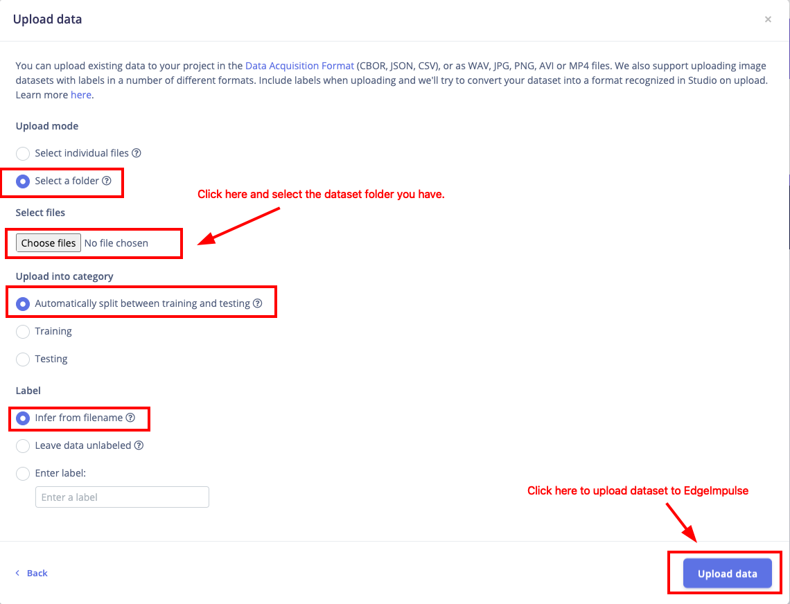
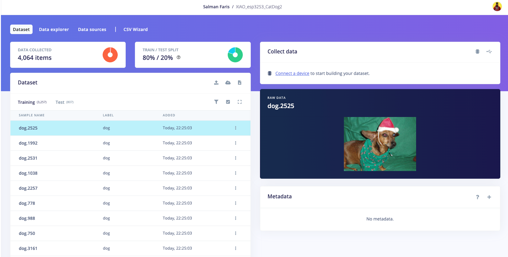
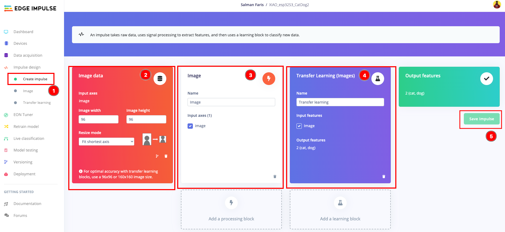
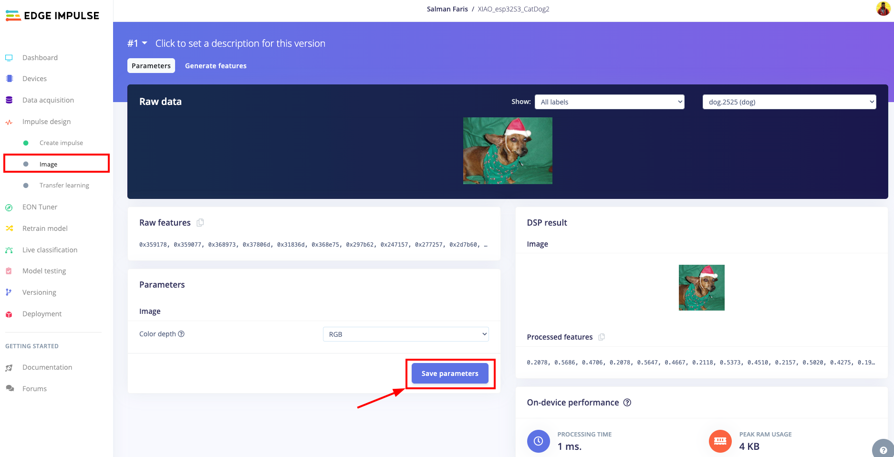
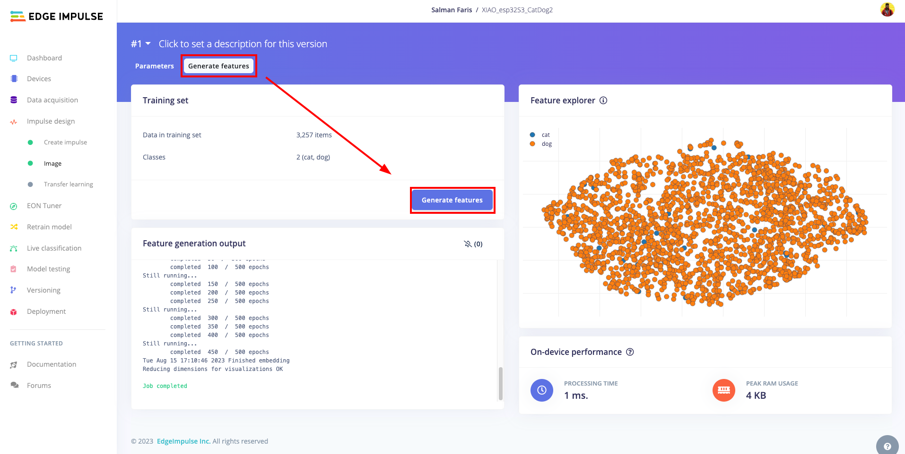
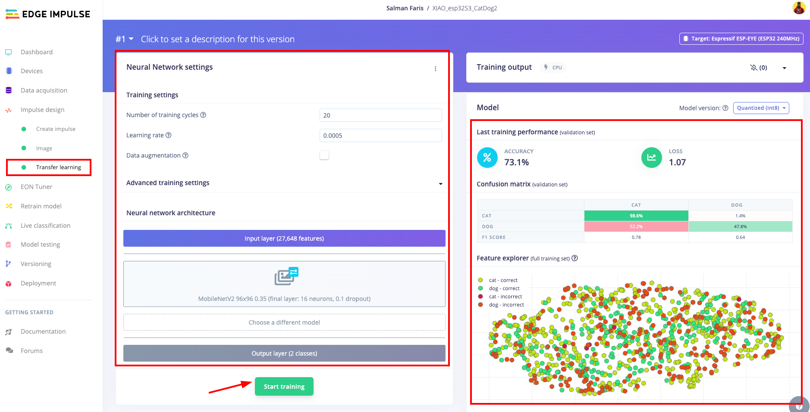

# Training a First Model in Edge Impulse

**Misheard City · Day 2–3**

[Back to Day 2](../README.md) · [Dataset review](../02_Dataset_Review/README.md)

[Edge Impulse](https://edgeimpulse.com/) is a web platform for training machine-learning models that run on small devices.

🔗 [Edge Impulse documentation](https://docs.edgeimpulse.com/)

---

## 1. Create the project

1. Sign in at [studio.edgeimpulse.com](https://studio.edgeimpulse.com/).
2. Create a project named **`Misheard_City_Group_0X`**, with the group number.
3. Collaborators are added in the project's **Dashboard**, where the plan allows it.

## 2. Upload the dataset

**Data acquisition → Add data → Upload data**, once for each category folder of the unzipped `dataset_upload.zip`.

*Upload settings: folder, automatic train/test split, label.*

| Setting | Choice |
|---|---|
| Upload mode | **Select a folder** → one category folder, e.g. `moss` |
| Upload into category | **Automatically split between training and testing** (about 80% / 20%) |
| Label | **Enter label** → the folder name, e.g. `moss` |

Edge Impulse resizes the images to the input size of the impulse (section 3).

*The dataset after upload, with the train/test split and labels.*

After upload:

- only the group's labels appear;
- the counts per label match `dataset_summary.txt`;
- the **test set** contains every label. The model never trains on the test set.

## 3. Create the impulse

**Impulse design → Create impulse**.

*Image data, Image block, Transfer Learning block and output features.*

| Block | Setting |
|---|---|
| Image data | **96 × 96**, resize mode **Fit shortest axis** |
| Processing block | **Image** |
| Learning block | **Transfer Learning (Images)** |

*Fit shortest axis* crops the centre of each image to a square. Select **Save Impulse**.

## 4. Generate features

**Image**: **Colour depth: RGB**, then **Save parameters**.

*Image block: colour depth and the processed 96 × 96 image.*

**Generate features → Generate features**.

*Feature generation and the feature explorer.*

The **feature explorer** maps the image features: nearby points look similar to the model. Clicking a point shows its image.

## 5. Train

**Transfer learning**.

| Setting | Value |
|---|---|
| Neural network | **MobileNetV2 96×96 0.35** (*Choose a different model*) |
| Number of training cycles | **20–30** |
| Learning rate | Default |
| Data augmentation | **On** |

Then **Start training**.

- **Transfer learning** starts from a network already trained on a large general image collection and retrains only its last layers on your categories.
- **Data augmentation** shows the model slightly changed copies during training: flipped, cropped, brighter or darker.
- **α (alpha)**, here 0.35, sets the width of MobileNet. Smaller α = smaller and faster, usually less accurate.

## 6. Read the results

*Accuracy, confusion matrix and feature explorer. Here, 52.2% of the dogs were classified as cats.*

- **Accuracy** is measured on a **validation** set held back from your training images.
- The **confusion matrix** shows how often each true label (rows) was predicted as each label (columns).
- In the feature explorer below it, **red points** are misclassified images.

## 7. Test with unseen images

**Model testing → Classify all** classifies the test set.

A test accuracy far below validation accuracy usually comes from a repeated background, different collection conditions or a very small test set. Accuracy on API images says little about the street; Day 3 tests the model on the device.

## 8. Further work — change one thing and compare

**Versioning** (left menu) saves the current state with a short description. Each new version changes **one** thing:

- a corrected label, or a damaged or irrelevant image removed;
- more images for the most confused category;
- rebalanced categories;
- revised category definitions, with the same input size and model.

Version table:

| Version | What changed | Validation accuracy | Test accuracy | Most confused pair | Notes |
|---|---|---|---|---|---|
| v1 | First dataset, MobileNetV2 0.35, 25 cycles | | | | |
| v2 | | | | | |

## 9. For Day 3

- The category definitions, the dataset summary and one image that required discussion.
- The confusion matrix and one error to investigate.
- The saved model version with the dataset that produced it.

## Troubleshooting

| Symptom | Cause |
|---|---|
| Every image under one label | All folders uploaded with the same label |
| No test samples | Uploaded as *Training*; **Dashboard → Perform train/test split** |
| High accuracy, low test accuracy | Near-duplicates or one repeated background |
| Accuracy close to chance | Categories not distinct at 96 × 96 |

## Sources

🔗 [Seeed Studio — XIAO ESP32S3 image classification](https://wiki.seeedstudio.com/tinyml_course_Image_classification_project/) · [Marcelo Rovai — *XIAO: Big Power, Small Board*, chapter 4.4](https://mjrovai.github.io/XIAO_Big_Power_Small_Board-ebook/chapter_4-4.html)

Edge Impulse screenshots: Seeed Studio XIAO ESP32S3 Edge Impulse guide (images by Salman Faris, [TinyML repository](https://github.com/salmanfarisvp/TinyML)), reproduced unchanged under [CC BY-SA 4.0](https://creativecommons.org/licenses/by-sa/4.0/) ([Seeed licence page](https://wiki.seeedstudio.com/License/)). Menu names in the current Edge Impulse version take precedence over the screenshots.

[Back to Day 2](../README.md)
