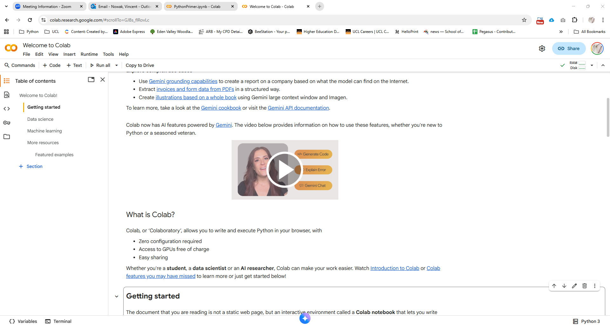
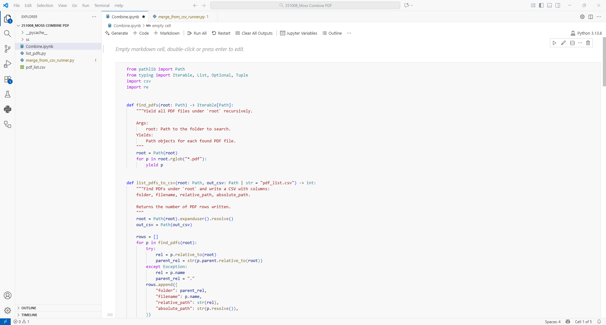
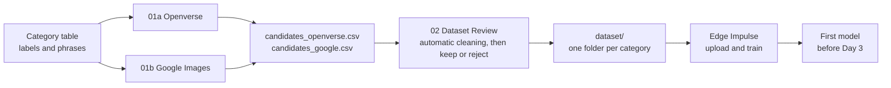

# Categories and Datasets
## Misheard City — Day 2

**Thursday 8 October · Kunpeng Lei**

[Workshop homepage](../README.md) · [Categories](#categories) · [Image sources](#image-sources) · [Working in Python](#working-in-python) · [Python basics](#python-basics) · [Collection and cleaning](#collection-and-cleaning) · [Openverse](01a_Openverse/README.md) · [Google Images](01b_Google_Images/README.md) · [Dataset review](02_Dataset_Review/README.md) · [Edge Impulse training](03_Edge_Impulse_Training/README.md)

**You need:** your categories, a laptop with a Google account, an email address and a mobile phone number for the image services, and a free [Edge Impulse](https://studio.edgeimpulse.com/) account.

---

## Categories

A classifier knows only the labels it is given. Each category is presented with its definition, example images and the reading behind it.

- The model sees **96 × 96 pixels**: textures and colours survive, small details do not.
- Every frame is assigned to one of the labels, including scenes that fit none. An `other` label collects them.
- An image search returns what other people have called a phrase.

| `label` | Definition | Search phrases | Excludes | Ambiguous case |
|---|---|---|---|---|
| `moss` | | | | |

Labels use lowercase letters, numbers and underscores, e.g. `weathered_paint`.

---

## Image sources

**Openverse** searches openly licensed and public-domain images; **Google Images**, through SerpAPI, searches the wider web: news, shops, blogs and social media. Images from both are used for training and in the film.

| | [01a Openverse](01a_Openverse/README.md) | [01b Google Images](01b_Google_Images/README.md) |
|---|---|---|
| Sign-up | Registration in the notebook, email verification | serpapi.com account, email and phone confirmation |
| Free use | 50 results per request when registered | 250 searches per month, one per phrase |
| Default | About 100 candidates per category | About 100 candidates per category |

The same phrase returns a different city in each.

---

## Working in Python

The notebooks run in **Google Colab**. **VS Code** runs the same notebooks on a laptop.

### Google Colab

Python in the browser, with a Google account and nothing to install.



*Google Colab in the browser.*

| Action | In Colab |
|---|---|
| Open a notebook | 🔗 links below |
| Keep your changes | **File → Save a copy in Drive** |
| Run every cell in order | **Runtime → Run all** |
| Clear all values | **Runtime → Restart session** |
| API keys | **Secrets** panel (key icon), with **Notebook access** on |
| Data | Google Drive, `MyDrive/Misheard_City_Data/<GROUP>`, after a one-time permission |

🔗 Open in Colab: [01a Openverse](https://colab.research.google.com/github/25217148/Misheard-City/blob/main/Day_02_Datasets_and_Training/01a_Openverse/01a_Openverse.ipynb) · [01b Google Images](https://colab.research.google.com/github/25217148/Misheard-City/blob/main/Day_02_Datasets_and_Training/01b_Google_Images/01b_Google_Images.ipynb) · [02 Dataset Review](https://colab.research.google.com/github/25217148/Misheard-City/blob/main/Day_02_Datasets_and_Training/02_Dataset_Review/02_Dataset_Review.ipynb)

> [!NOTE]
> Search and review share one folder. The same `GROUP` name on two Google accounts gives two separate folders.

### VS Code on your own computer

**Visual Studio Code** runs the same notebooks on a laptop, without a browser session. Files stay on the computer, and the keys are environment variables.



*Visual Studio Code with a notebook open.*

**Steps**

1. **Python 3:** the installer from [python.org/downloads](https://www.python.org/downloads/). On Windows, **Add python.exe to PATH** on the first screen.
2. **VS Code:** the installer from [code.visualstudio.com](https://code.visualstudio.com/).
3. **Extensions** (left bar, four squares): **Python** and **Jupyter**, both by Microsoft.
4. **The repository:** **Code → Download ZIP** on GitHub, unzipped, then **File → Open Folder…** in VS Code.
5. **Libraries:** **Terminal → New Terminal**, then

   ```text
   python -m pip install requests pandas pillow matplotlib
   ```

   On macOS, `python3` in place of `python`.
6. **Kernel:** an `.ipynb` file open, **Select Kernel** (top right) → **Python Environments** → the Python 3 from step 1.
7. **Keys:** environment variables, read when VS Code starts again.

   ```text
   # macOS (add to ~/.zshrc)
   export OPENVERSE_CLIENT_ID="..."
   export OPENVERSE_CLIENT_SECRET="..."
   export SERPAPI_API_KEY="..."

   # Windows (Command Prompt)
   setx OPENVERSE_CLIENT_ID "..."
   setx OPENVERSE_CLIENT_SECRET "..."
   setx SERPAPI_API_KEY "..."
   ```

Data is saved in `Misheard_City_Data/<GROUP>` in the home folder, e.g. `C:\Users\<name>\Misheard_City_Data` or `/Users/<name>/Misheard_City_Data`, the same for all three notebooks. Outside Colab, the Drive connection and the ZIP download are skipped, and `USE_GOOGLE_DRIVE` has no effect.

---

---

## Python basics

### Cells

A notebook is a sequence of **cells**. **Shift + Enter** (or ▶) runs a cell; the output appears below it. A value exists only after the cell that creates it has run, and **Runtime → Restart session** clears all values.

### Values and variables

```python
GROUP = "Group_01"            # str: text, always in quotes
PAGES_PER_QUERY = 1           # int: a whole number
USE_GOOGLE_DRIVE = True       # bool: True or False
```

`=` stores a value under a name.

### Lists and dictionaries

```python
CATEGORIES = {                # dict: each label leads to a list of phrases
    "moss": ["moss on brick wall", "moss between paving stones"],
    "stain": ["water stain on concrete wall", "rust stain on wall"],
}
```

| Code | Type | Result |
|---|---|---|
| `["moss on brick wall", "rust stain on wall"]` | `list`: values in order | — |
| `{"moss": [...], "stain": [...]}` | `dict`: `key: value` pairs | — |
| `CATEGORIES["moss"]` | Look up a key | `['moss on brick wall', 'moss between paving stones']` |
| `CATEGORIES["moss"][0]` | First item of the list; counting starts at 0 | `'moss on brick wall'` |

Brackets, quotes and commas must be complete: a missing `,` or `]` stops the whole cell.

### Loops

```python
for label, queries in CATEGORIES.items():
    for query in queries:
        print(label, "|", query)
```

```text
moss | moss on brick wall
moss | moss between paving stones
stain | water stain on concrete wall
stain | rust stain on wall
```

`.items()` gives each label with its list. **Indentation is structure**: the indented lines run once for every item.

### Calling a function

```python
response = requests.get(f"{API}/images/", params=params, headers=HEADERS, timeout=30)
```

- `requests.get` calls the function `get` from the `requests` library.
- The values in brackets are **arguments**: first the address, then `name=value` settings.
- `f"{API}/images/"` is an **f-string**: `{API}` is replaced by the value of `API`, giving `https://api.openverse.org/v1/images/`.

### Defining a function

```python
def safe(text):
    """Turn any text into a short, file-safe name."""
    return re.sub(r"[^a-z0-9]+", "_", str(text).lower()).strip("_") or "unknown"
```

`def` names a function; `text` is its **parameter**; `return` gives back the result. `safe("Moss on brick wall!")` returns `'moss_on_brick_wall'`.

### Libraries

```python
import requests                 # web requests
import pandas as pd             # tables; used as pd.DataFrame, pd.read_csv
from pathlib import Path        # one part of a library: file and folder paths
```

### Reading an error

Python stops at the first error. Read the **last line** of the message first: the error type and its cause.

| Last line | Cause |
|---|---|
| `NameError: name 'CATEGORIES' is not defined` | An earlier cell has not been run |
| `KeyError: 'mos'` | A dict has no such key: check the spelling |
| `SyntaxError` | A missing bracket, quote, comma or colon |
| `IndentationError` | The lines of a block are not equally indented |
| `ModuleNotFoundError` | The library is not installed in this environment |

An AI assistant needs the cell and the complete error message.

---

## Collection and cleaning



### Code types

Every code cell starts with its type and ends with a line that starts with **✓**. Comments in capitals mark each operation inside a cell, e.g. `# DEDUPLICATE:` or `# FILTER:`.

| Type | What the code does | Where |
|---|---|---|
| **SET-UP** | Settings, libraries, folders, keys | 01a, 01b, 02 |
| **COLLECT** | Searches, saved responses, downloads | 01a, 01b |
| **CLEAN** | Licence and photograph filters; repeats, failed downloads, damaged, small and near-duplicate images removed; the group's keep or reject | 01a, 01b, 02 |
| **CHECK** | First results, image grids, contact sheets, balance | 01a, 01b, 02 |
| **EXPORT** | Kept images copied into one folder per category; summary; ZIP | 02 |

### Steps and outputs

| Step | Page | Output |
|---|---|---|
| 1a | [Openverse](01a_Openverse/README.md) | `candidates_openverse.csv`, `candidates/<label>/` |
| 1b | [Google Images](01b_Google_Images/README.md) | `candidates_google.csv`, `candidates/<label>/google_*.jpg` |
| 2 | [Dataset review](02_Dataset_Review/README.md) | `removed.csv`, `review.csv`, `dataset/<label>/`, `dataset_summary.txt`, `dataset_upload.zip` |
| 3 | [Edge Impulse training](03_Edge_Impulse_Training/README.md) | A trained project, a confusion matrix and a version table |

---

## For Day 3

- The revised category table and one image the group debated.
- `review.csv` and `dataset_summary.txt`.
- The [first model](03_Edge_Impulse_Training/README.md) and its confusion matrix.
- The images noted `ambiguous` in `review.csv`, for testing.

## Troubleshooting

| Symptom | Cause |
|---|---|
| `No candidates file found` in notebook 02 | Different `GROUP` names, or 01a/01b not finished |
| Drive does not mount | Google permission dialog not accepted |
| Wrong labels in Edge Impulse | A folder uploaded with another label |
| `ModuleNotFoundError` in VS Code | `pip` ran for a different Python than the kernel |
| `No credentials found` in VS Code | VS Code started before the variables were set |

Registration and key errors: [01a](01a_Openverse/README.md#troubleshooting), [01b](01b_Google_Images/README.md#troubleshooting).

## Sources

🔗 [Openverse API documentation](https://api.openverse.org/v1/) · [Openverse Terms of Service](https://docs.openverse.org/terms_of_service.html) · [SerpAPI Google Images API](https://serpapi.com/google-images-api) · [Creative Commons licences](https://creativecommons.org/licenses/) · [Edge Impulse documentation](https://docs.edgeimpulse.com/)

Colab and VS Code screenshots: [Pervasive Urbanism 2025–26](https://github.com/PervasiveUrbanism/PervasiveUrbanism_25-26), used with permission.

[Continue to Openverse](01a_Openverse/README.md)
