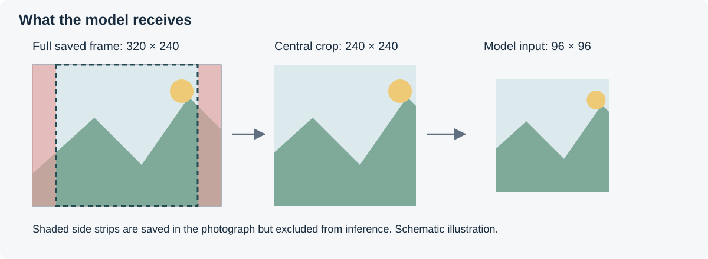
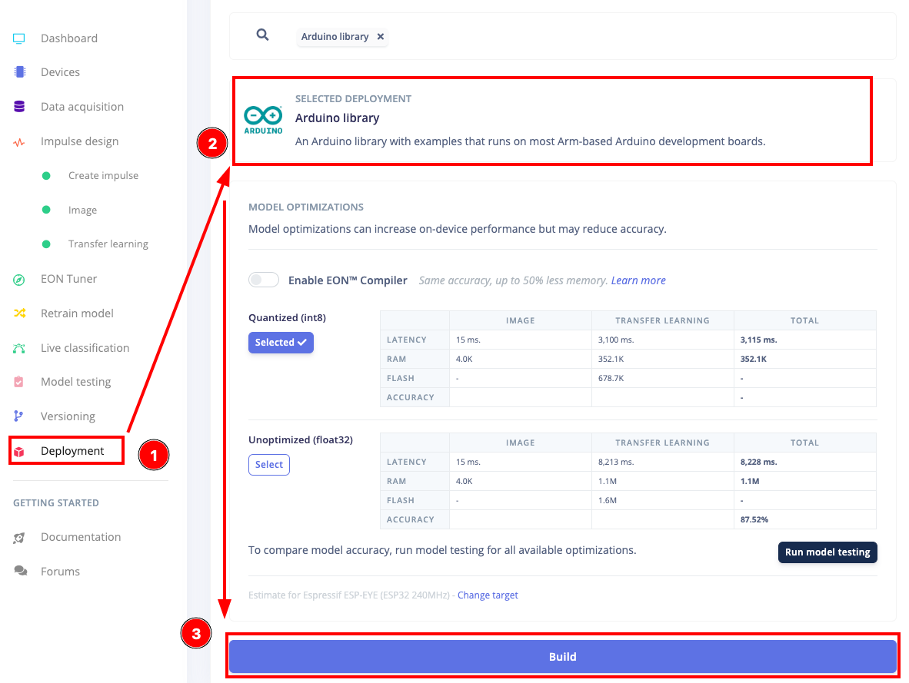
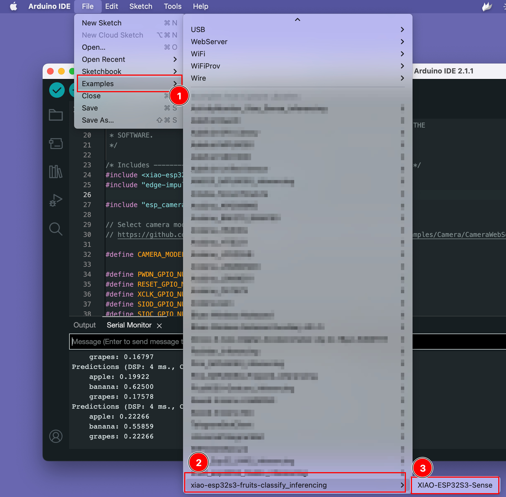
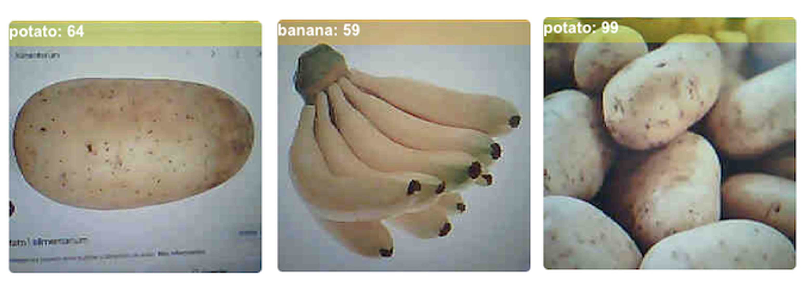
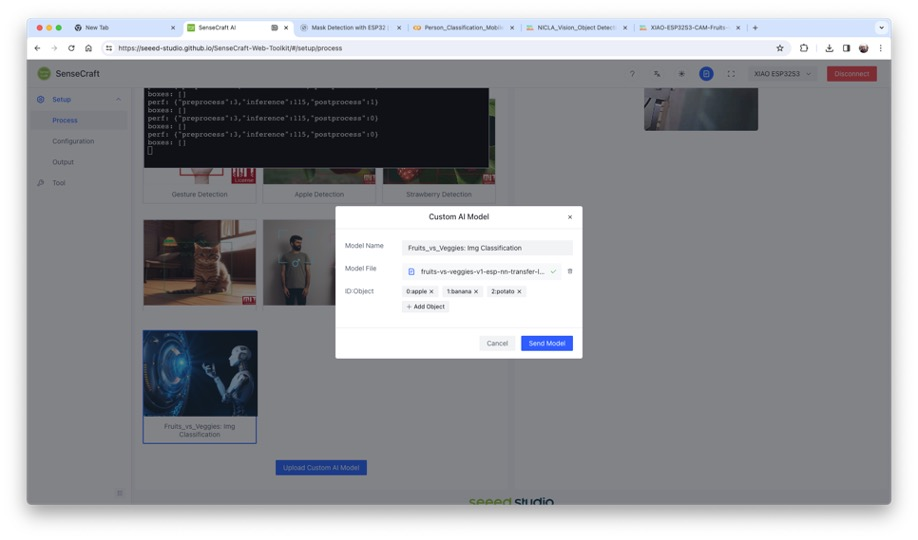
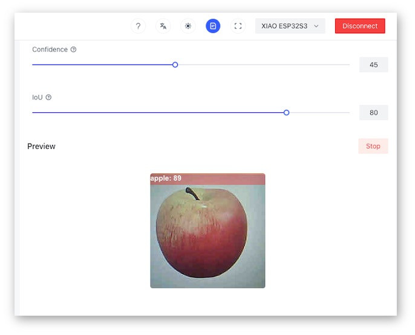
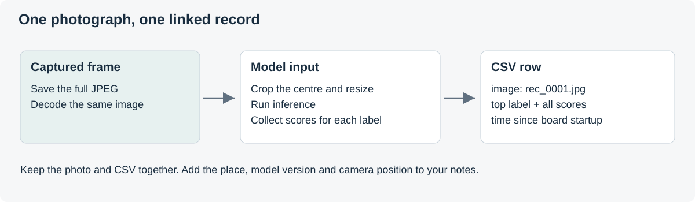

# Model Deployment, Field Recording and Storyboard
## Misheard City — Day 3

**Friday 9 October · Kunpeng Lei**

[Workshop homepage](../README.md) · [Tutorial](#tutorial) · [From model to device](#from-model-to-device) · [Deploy](#deploy-the-model) · [First readings](#first-readings) · [Field recorder](#field-recorder) · [AI script](#ai-script) · [Storyboard](#storyboard) · [Field collection](#field-collection)

**You need:** category definitions, the readings behind them, reviewed dataset, trained Edge Impulse project, `script.md` version 1, laptop, XIAO kit with a prepared microSD card, card reader, power bank, a few reference images and an ambiguous example.

## Tutorial

One difficult classification decision, with the images behind it and the confusion matrix. It leads to a clearer definition, different examples or another way of collecting images, and to one test on the device.

---

# From Model to Device

An Edge Impulse **Arduino library** contains the trained model and the code that runs it on a microcontroller.

| In Edge Impulse | On the XIAO |
|---|---|
| Images uploaded from a dataset | A live camera frame at 320 × 240 pixels |
| Resized during training | The **centre** of the frame, cropped to a square and scaled to the model size |
| Floating-point model available | The **quantised (int8)** model, smaller and faster |
| Scores shown in the browser | Scores printed over Serial or written to the microSD card |



*The 320 × 240 capture and the 96 × 96 model input. The sides of the frame do not reach the model.*

On the XIAO ESP32S3, MobileNetV2 96 × 96, α = 0.35, RGB, runs one inference in about **219 ms**.

---

# Deploy the Model

## 1. Board package

The Edge Impulse camera examples need **esp32 by Espressif Systems 2.0.17**; 3.x versions change the camera and inference code. Boards with the newer **OV3660** camera use the same connections and sketches.

| Setting | Selection |
|---|---|
| Board | XIAO_ESP32S3 |
| esp32 package | **2.0.17** (Boards Manager → `esp32` → version list) |
| USB CDC On Boot | Enabled |
| PSRAM | **OPI PSRAM**, for the camera and the model |
| Serial Monitor | 115200 baud |

> [!NOTE]
> `Camera initialisation failed` points to a loose camera connector, checked with the power off.

## 2. Arduino library

**Deployment → Arduino library** in the Edge Impulse project.



*Deployment page: Arduino library, EON Compiler option, quantised model and Build.*

- **EON Compiler**: off for the first build.
- **Quantized (int8)**: selected.
- **Build** downloads a ZIP named after the project.
- Latency and memory on this page are estimates for another target, such as the ESP-EYE.

Each export is a new model version, with its date.

> [!NOTE]
> The sketches stop at compilation with `Set Impulse design > … Fit shortest axis` when the impulse uses another resize mode.

## 3. Install the library

**Sketch → Include Library → Add .ZIP Library…**, with the ZIP as downloaded; a library of the same name is replaced.

The library's **header name** is the first `#include` line of **File → Examples → `<project>_inferencing` → esp32 → esp32_camera**:

```cpp
#include <Misheard_City_Group_01_inferencing.h>
```



*The library's examples under File → Examples.*

**Verify** (✓) compiles without a board connected.

## Run 01 — Classify over Serial

[01_Classify_Serial.ino](01_Classify_Serial/01_Classify_Serial.ino) classifies one camera frame per second and prints the scores.

**Steps**

1. Replace the `#include` line at the top with the library's header.
2. Upload. The first compilation of a library takes several minutes.
3. Serial Monitor at 115200 baud; RESET repeats the startup messages.

| Step | Function in the sketch |
|---|---|
| Capture a JPEG frame | `esp_camera_fb_get()` |
| Convert it to RGB pixels | `fmt2rgb888()` |
| Crop the centre and resize to the model input | `crop_and_interpolate_rgb888()` |
| Run the model and print the scores | `run_classifier()` and `classifyAndReport()` |

Output, with the group's own labels:

```text
Misheard City: on-device classification
Model input: 96 x 96, labels: 3
Ready. Classifying once per second.

reading=12, dsp_ms=4, classify_ms=210
  moss: 0.082
  stain: 0.871
  weathered_paint: 0.047
top=stain, score=0.87
```

### Follow the code

**1. Model input.**

```cpp
ei::image::processing::crop_and_interpolate_rgb888(
    rgbBuffer, FRAME_WIDTH, FRAME_HEIGHT,
    rgbBuffer, EI_CLASSIFIER_INPUT_WIDTH, EI_CLASSIFIER_INPUT_HEIGHT);
```

**2. Inference.** The signal tells the library how to read the prepared pixels.

```cpp
ei::signal_t signal;
signal.total_length = EI_CLASSIFIER_INPUT_WIDTH * EI_CLASSIFIER_INPUT_HEIGHT;
signal.get_data = &getModelData;

ei_impulse_result_t result = { 0 };
EI_IMPULSE_ERROR error = run_classifier(&signal, &result, false);
```

**3. Output.** `classifyAndReport()` prints each score, then the top score against `CONFIDENCE_THRESHOLD`.

### Complete classification sketch

<details>
<summary>Complete sketch</summary>

```cpp
// MISHEARD CITY | Day 3 | 01 - Classify camera images and report over Serial
// Board: XIAO_ESP32S3 with Sense camera. Board package: esp32 by Espressif 2.0.17.
// USB CDC On Boot: Enabled. PSRAM: OPI PSRAM. Serial Monitor: 115200.
// Adapted for teaching from the Edge Impulse esp32_camera example, as modified
// for the XIAO ESP32S3 Sense by Marcelo Rovai and Seeed Studio.
// See the source and licence notes in the Day 3 README.

// Replace this line with the header of YOUR group's exported library.
// Find the exact name in the first line of the library's own example sketch.
#include <Misheard_City_Group_01_inferencing.h>

#include "edge-impulse-sdk/dsp/image/image.hpp"
#include "esp_camera.h"
#include "img_converters.h"

#if !defined(EI_CLASSIFIER_SENSOR) || EI_CLASSIFIER_SENSOR != EI_CLASSIFIER_SENSOR_CAMERA
#error "This sketch needs an Edge Impulse image model."
#endif
#if EI_CLASSIFIER_OBJECT_DETECTION == 1
#error "This sketch expects image classification, not object detection."
#endif
#if defined(EI_CLASSIFIER_RESIZE_MODE) && EI_CLASSIFIER_RESIZE_MODE != EI_CLASSIFIER_RESIZE_FIT_SHORTEST
#error "Set Impulse design > Image data > Resize mode to Fit shortest axis, then retrain and export again."
#endif

// Size of each camera frame before it is reduced for the model.
const int FRAME_WIDTH = 320;   // QVGA
const int FRAME_HEIGHT = 240;

const float CONFIDENCE_THRESHOLD = 0.60f;      // Below this, report "uncertain".
const unsigned long CLASSIFY_INTERVAL_MS = 1000;

uint8_t *rgbBuffer = nullptr;  // One frame as RGB pixels, 3 bytes per pixel.
bool deviceReady = false;
unsigned long readingCount = 0;
unsigned long lastReadingAt = 0;

bool startCamera() {
  camera_config_t config = {};
  config.ledc_channel = LEDC_CHANNEL_0;
  config.ledc_timer = LEDC_TIMER_0;

  // Fixed connections on the XIAO ESP32S3 Sense camera (same as Day 1).
  config.pin_d0 = 15;
  config.pin_d1 = 17;
  config.pin_d2 = 18;
  config.pin_d3 = 16;
  config.pin_d4 = 14;
  config.pin_d5 = 12;
  config.pin_d6 = 11;
  config.pin_d7 = 48;
  config.pin_xclk = 10;
  config.pin_pclk = 13;
  config.pin_vsync = 38;
  config.pin_href = 47;
  config.pin_sccb_sda = 40;
  config.pin_sccb_scl = 39;
  config.pin_pwdn = -1;
  config.pin_reset = -1;

  config.xclk_freq_hz = 20000000;
  config.pixel_format = PIXFORMAT_JPEG;
  config.frame_size = FRAMESIZE_QVGA;  // Must match FRAME_WIDTH x FRAME_HEIGHT.
  config.jpeg_quality = 12;
  config.fb_count = 2;
  config.fb_location = CAMERA_FB_IN_PSRAM;
  config.grab_mode = CAMERA_GRAB_LATEST;  // Always classify the newest view.

  if (!psramFound()) {
    Serial.println("PSRAM unavailable. Check Tools > PSRAM.");
    return false;
  }

  esp_err_t result = esp_camera_init(&config);
  if (result != ESP_OK) {
    Serial.printf("Camera initialisation failed: 0x%x\n", result);
    return false;
  }
  return true;
}

// Take one photograph and turn it into the small RGB image the model expects.
bool captureForModel() {
  camera_fb_t *frame = esp_camera_fb_get();
  if (frame == nullptr) {
    Serial.println("No camera frame received.");
    return false;
  }

  bool converted = fmt2rgb888(frame->buf, frame->len, PIXFORMAT_JPEG, rgbBuffer);
  esp_camera_fb_return(frame);  // Release the camera buffer.

  if (!converted) {
    Serial.println("Could not convert the JPEG frame.");
    return false;
  }

  // Crop the centre of the frame and scale it to the model's input size,
  // e.g. 96 x 96. The model never sees the edges of the 320 x 240 view.
  if (EI_CLASSIFIER_INPUT_WIDTH != FRAME_WIDTH ||
      EI_CLASSIFIER_INPUT_HEIGHT != FRAME_HEIGHT) {
    ei::image::processing::crop_and_interpolate_rgb888(
        rgbBuffer, FRAME_WIDTH, FRAME_HEIGHT,
        rgbBuffer, EI_CLASSIFIER_INPUT_WIDTH, EI_CLASSIFIER_INPUT_HEIGHT);
  }
  return true;
}

// Edge Impulse asks for pixels in portions; each pixel is packed as 0xRRGGBB.
int getModelData(size_t offset, size_t length, float *out) {
  size_t byteIndex = offset * 3;
  for (size_t i = 0; i < length; i++) {
    // fmt2rgb888 stores each pixel as B, G, R, so the order is swapped here.
    out[i] = (rgbBuffer[byteIndex + 2] << 16) +
             (rgbBuffer[byteIndex + 1] << 8) +
             rgbBuffer[byteIndex];
    byteIndex += 3;
  }
  return 0;
}

void classifyAndReport() {
  if (!captureForModel()) {
    return;
  }

  ei::signal_t signal;
  signal.total_length = EI_CLASSIFIER_INPUT_WIDTH * EI_CLASSIFIER_INPUT_HEIGHT;
  signal.get_data = &getModelData;

  ei_impulse_result_t result = { 0 };
  EI_IMPULSE_ERROR error = run_classifier(&signal, &result, false);
  if (error != EI_IMPULSE_OK) {
    Serial.printf("Classifier error: %d\n", error);
    return;
  }

  readingCount = readingCount + 1;
  Serial.printf("reading=%lu, dsp_ms=%d, classify_ms=%d\n",
                readingCount, result.timing.dsp, result.timing.classification);

  size_t top = 0;
  for (size_t i = 0; i < EI_CLASSIFIER_LABEL_COUNT; i++) {
    Serial.printf("  %s: %.3f\n",
                  result.classification[i].label,
                  result.classification[i].value);
    if (result.classification[i].value > result.classification[top].value) {
      top = i;
    }
  }

  float topScore = result.classification[top].value;
  if (topScore >= CONFIDENCE_THRESHOLD) {
    Serial.printf("top=%s, score=%.2f\n\n", result.classification[top].label, topScore);
  } else {
    Serial.printf("top=uncertain, best_guess=%s, score=%.2f\n\n",
                  result.classification[top].label, topScore);
  }
}

void setup() {
  Serial.begin(115200);
  // Give USB serial a moment to connect without waiting forever.
  unsigned long waitStarted = millis();
  while (!Serial && millis() - waitStarted < 3000) {
    delay(10);
  }

  Serial.println("Misheard City: on-device classification");
  Serial.printf("Model input: %d x %d, labels: %d\n",
                EI_CLASSIFIER_INPUT_WIDTH, EI_CLASSIFIER_INPUT_HEIGHT,
                EI_CLASSIFIER_LABEL_COUNT);

  if (!startCamera()) {
    Serial.println("Resolve the camera issue, then press RESET.");
    return;
  }

  rgbBuffer = (uint8_t *)ps_malloc(FRAME_WIDTH * FRAME_HEIGHT * 3);
  if (rgbBuffer == nullptr) {
    Serial.println("Could not reserve image memory. Check Tools > PSRAM.");
    return;
  }

  deviceReady = true;
  Serial.println("Ready. Classifying once per second.\n");
}

void loop() {
  if (!deviceReady) {
    delay(1000);
    return;
  }

  if (millis() - lastReadingAt >= CLASSIFY_INTERVAL_MS) {
    lastReadingAt = millis();
    classifyAndReport();
  }
  delay(10);
}

/*
Edge Impulse Arduino examples
Copyright (c) 2022 EdgeImpulse Inc.

Permission is hereby granted, free of charge, to any person obtaining a copy
of this software and associated documentation files (the "Software"), to deal
in the Software without restriction, including without limitation the rights
to use, copy, modify, merge, publish, distribute, sublicense, and/or sell
copies of the Software, and to permit persons to whom the Software is
furnished to do so, subject to the following conditions:

The above copyright notice and this permission notice shall be included in
all copies or substantial portions of the Software.

THE SOFTWARE IS PROVIDED "AS IS", WITHOUT WARRANTY OF ANY KIND, EXPRESS OR
IMPLIED, INCLUDING BUT NOT LIMITED TO THE WARRANTIES OF MERCHANTABILITY,
FITNESS FOR A PARTICULAR PURPOSE AND NONINFRINGEMENT. IN NO EVENT SHALL THE
AUTHORS OR COPYRIGHT HOLDERS BE LIABLE FOR ANY CLAIM, DAMAGES OR OTHER
LIABILITY, WHETHER IN AN ACTION OF CONTRACT, TORT OR OTHERWISE, ARISING FROM,
OUT OF OR IN CONNECTION WITH THE SOFTWARE OR THE USE OR OTHER DEALINGS IN THE
SOFTWARE.

XIAO ESP32S3 adaptation: Marcelo Rovai, XIAO-ESP32S3-Sense
(https://github.com/Mjrovai/XIAO-ESP32S3-Sense), Apache License 2.0.
*/
```

</details>

### Reading the scores

- The scores add up to about **1.0**. The model has no answer for "none of these" without a category for it.
- A high score shows how strongly the model prefers one label. It is **not a probability that the label is true** in the world.
- `CONFIDENCE_THRESHOLD = 0.60f` is a decision. Below it, the sketch prints `top=uncertain`.
- `dsp_ms` and `classify_ms`: preparation and inference time on the XIAO.

---

## First readings

Five tests per category:

- **two reference images** on a screen or printout, close to the training data;
- **two real objects or surfaces** in the room or outside the door;
- **one ambiguous case**.

| Shown | Expected | Top label | Score | Second label | Screen or print / light / distance / background | Note |
|---|---|---|---|---|---|---|
| | | | | | | |



*A potato and bananas classified on a XIAO ESP32S3 Sense. The first is a photograph on a screen.*

Repeated errors point either to a gap in the dataset or to a boundary between categories that was never clear. Bowker and Star treat categories as decisions with consequences; Haraway, observation as shaped by its instruments.

## AI-assisted modification (optional)

Small changes to test on the device:

- a line only when the top label changes;
- a different threshold for each category;
- a count of each label over one minute.

> I am using Arduino C++ with a Seeed Studio XIAO ESP32S3 Sense, esp32 board package 2.0.17 and an Edge Impulse image-classification library. Here is our current sketch: [paste the code].
>
> Change it so that it prints a line only when the top label changes. Keep the camera configuration, the model functions and the threshold. Do not use the LED on GPIO21. Explain the changed lines and provide the complete revised sketch.

<details>
<summary>Optional — SenseCraft live preview</summary>

Seeed's **SenseCraft Web Toolkit** shows the camera image with its classification, in Chrome or Edge.



*Uploading a custom model: the model file and labels entered in alphabetical order.*



*SenseCraft preview with a confidence slider and the result shown over the image.*

**Steps**

1. Edge Impulse **Dashboard** → **Transfer learning model — TensorFlow Lite (int8 quantized)**.
2. [SenseCraft Web Toolkit](https://seeed-studio.github.io/SenseCraft-Web-Toolkit/) → **XIAO ESP32S3** → connect.
3. **Upload Custom AI Model**: the `.tflite` file, with the labels **in alphabetical order**, as in Edge Impulse.

> [!NOTE]
> SenseCraft replaces the program on the board; the Arduino sketch has to be uploaded again afterwards.

</details>

---

# Field Recorder

The field recorder saves **one photograph** and the **model's reading of that photograph** as one row of a CSV file.

## What the recorder does

| Step | In the sketch |
|---|---|
| Capture one camera frame | `esp_camera_fb_get()` |
| Save it as a JPEG, without overwriting earlier files | `/rec_0001.jpg`, `/rec_0002.jpg`… |
| Convert the **same frame**, crop its centre and classify it | `fmt2rgb888()`, `crop_and_interpolate_rgb888()`, `run_classifier()` |
| Save the 96 × 96 image the model read, as a BMP | `/rec_0001_model.bmp`, `/rec_0002_model.bmp`… |
| Append a row to the session log | `/log_01.csv`, `/log_02.csv`… |

A new log file starts each time the board starts or is reset. Image numbers continue across sessions.

## Log format

One row per record, with the group's own labels:

```text
record,millis_ms,image,top_label,top_score,score_moss,score_stain,score_weathered_paint
7,184530,rec_0007.jpg,stain,0.871,0.082,0.871,0.047
8,194531,rec_0008.jpg,moss,0.512,0.512,0.301,0.187
```

| Column | Meaning |
|---|---|
| `record` | Number of the record and its image |
| `millis_ms` | Milliseconds since the board started. **Not a clock time** |
| `image` | The photograph on the card that was classified |
| `top_label`, `top_score` | The highest-scoring label and its score, even below 0.60 |
| `score_…` | One column per label, in the order Edge Impulse uses |

`top_label` is the highest score, not an accepted identification. The device has no GPS or clock: the start time, place, model version and camera position of each log file exist only in the field notes.

## Recording sequence



*The filename connects a saved photograph to its row of scores.*

`makeRecord()` saves the JPEG, classifies the same frame and builds one CSV row.

**Save the photograph.**

```cpp
size_t writtenBytes = photo.write(frame->buf, frame->len);
bool photoComplete = (writtenBytes == frame->len);
photo.close();
```

**Classify the image** as in sketch 01. The JPEG keeps the full frame; the model uses its central crop.

**Append the record.** On the ESP32, `FILE_WRITE` empties an existing file; the log uses `FILE_APPEND`.

```cpp
File logFile = SD.open(logPath, FILE_APPEND);
if (!logFile) {
  Serial.println("Could not open the log file.");
  return;
}
logFile.println(row);
logFile.close();
```

## Settings

🔗 [02_Field_Recorder.ino](02_Field_Recorder/02_Field_Recorder.ino)

The `#include` line takes the library's header, as in [sketch 01](#run-01--classify-over-serial). The mode is set at the top of the sketch:

```cpp
// ---- Settings to change ----------------------------------------------------
const bool AUTO_CAPTURE = false;              // false: send c; true: timed records.
const unsigned long CAPTURE_INTERVAL_MS = 10000;
const bool SAVE_MODEL_VIEW = true;            // Also save the 96 x 96 image the model read.
// -----------------------------------------------------------------------------
```

| Mode | Use |
|---|---|
| `AUTO_CAPTURE = false` | One record for each **c** sent from Serial Monitor, with the laptop nearby |
| `AUTO_CAPTURE = true` | A record every 10 s while the board has power, from a USB power bank, without a laptop |
| `SAVE_MODEL_VIEW = true` | `rec_0007_model.bmp` beside `rec_0007.jpg`: the central crop at the model's size, as the model read it |

Board settings as for sketch 01: **esp32 2.0.17**, **XIAO_ESP32S3**, **USB CDC On Boot: Enabled**, **PSRAM: OPI PSRAM**.

## Complete recorder sketch

<details>
<summary>Complete sketch</summary>

```cpp
// MISHEARD CITY | Day 3 | 02 - Field recorder
// Saves a photograph and the model's reading of that same photograph
// as one row of a CSV file on the microSD card.
// Board: XIAO_ESP32S3 with Sense camera / microSD. esp32 by Espressif 2.0.17.
// USB CDC On Boot: Enabled. PSRAM: OPI PSRAM. Serial Monitor: 115200.
// Adapted for teaching from the Edge Impulse esp32_camera example (XIAO version
// by Marcelo Rovai and Seeed Studio) and the Day 1 camera / microSD sketch.
// See the source and licence notes in the accompanying README.

// Replace this line with the header of YOUR group's exported library.
#include <Misheard_City_Group_01_inferencing.h>

#include "edge-impulse-sdk/dsp/image/image.hpp"
#include "esp_camera.h"
#include "img_converters.h"
#include "FS.h"
#include "SD.h"
#include "SPI.h"

#if !defined(EI_CLASSIFIER_SENSOR) || EI_CLASSIFIER_SENSOR != EI_CLASSIFIER_SENSOR_CAMERA
#error "This sketch needs an Edge Impulse image model."
#endif
#if EI_CLASSIFIER_OBJECT_DETECTION == 1
#error "This sketch expects image classification, not object detection."
#endif
#if defined(EI_CLASSIFIER_RESIZE_MODE) && EI_CLASSIFIER_RESIZE_MODE != EI_CLASSIFIER_RESIZE_FIT_SHORTEST
#error "Set Impulse design > Image data > Resize mode to Fit shortest axis, then retrain and export again."
#endif

// ---- Settings to change ----------------------------------------------------
const bool AUTO_CAPTURE = false;              // false: send c; true: timed records.
const unsigned long CAPTURE_INTERVAL_MS = 10000;
const bool SAVE_MODEL_VIEW = true;            // Also save the 96 x 96 image the model read.
// -----------------------------------------------------------------------------

const int SD_CS_PIN = 21;   // Shared with the user LED: no blinking here.
const int FRAME_WIDTH = 320;
const int FRAME_HEIGHT = 240;

uint8_t *rgbBuffer = nullptr;
bool deviceReady = false;
unsigned long nextImage = 1;
unsigned long lastRecordAt = 0;
char logPath[20];

bool startCamera() {
  camera_config_t config = {};
  config.ledc_channel = LEDC_CHANNEL_0;
  config.ledc_timer = LEDC_TIMER_0;

  // Fixed connections on the XIAO ESP32S3 Sense camera (same as Day 1).
  config.pin_d0 = 15;
  config.pin_d1 = 17;
  config.pin_d2 = 18;
  config.pin_d3 = 16;
  config.pin_d4 = 14;
  config.pin_d5 = 12;
  config.pin_d6 = 11;
  config.pin_d7 = 48;
  config.pin_xclk = 10;
  config.pin_pclk = 13;
  config.pin_vsync = 38;
  config.pin_href = 47;
  config.pin_sccb_sda = 40;
  config.pin_sccb_scl = 39;
  config.pin_pwdn = -1;
  config.pin_reset = -1;

  config.xclk_freq_hz = 20000000;
  config.pixel_format = PIXFORMAT_JPEG;
  config.frame_size = FRAMESIZE_QVGA;  // Must match FRAME_WIDTH x FRAME_HEIGHT.
  config.jpeg_quality = 12;
  config.fb_count = 2;
  config.fb_location = CAMERA_FB_IN_PSRAM;
  config.grab_mode = CAMERA_GRAB_LATEST;

  if (!psramFound()) {
    Serial.println("PSRAM unavailable. Check Tools > PSRAM.");
    return false;
  }

  esp_err_t result = esp_camera_init(&config);
  if (result != ESP_OK) {
    Serial.printf("Camera initialisation failed: 0x%x\n", result);
    return false;
  }
  return true;
}

int getModelData(size_t offset, size_t length, float *out) {
  size_t byteIndex = offset * 3;
  for (size_t i = 0; i < length; i++) {
    // fmt2rgb888 stores each pixel as B, G, R, so the order is swapped here.
    out[i] = (rgbBuffer[byteIndex + 2] << 16) +
             (rgbBuffer[byteIndex + 1] << 8) +
             rgbBuffer[byteIndex];
    byteIndex += 3;
  }
  return 0;
}

// Choose a new log file for each session, e.g. /log_03.csv.
bool startLog() {
  for (int session = 1; session < 100; session++) {
    snprintf(logPath, sizeof(logPath), "/log_%02d.csv", session);
    if (!SD.exists(logPath)) {
      File logFile = SD.open(logPath, FILE_WRITE);
      if (!logFile) {
        return false;
      }
      logFile.print("record,millis_ms,image,top_label,top_score");
      for (size_t i = 0; i < EI_CLASSIFIER_LABEL_COUNT; i++) {
        logFile.print(",score_");
        logFile.print(ei_classifier_inferencing_categories[i]);
      }
      logFile.println();
      logFile.close();
      return true;
    }
  }
  return false;
}

// Save the model's input, still in rgbBuffer, as a BMP: /rec_0007_model.bmp.
// BMP stores pixels as B, G, R, the same order fmt2rgb888 produces.
void saveModelView(unsigned long recordNumber) {
  const int w = EI_CLASSIFIER_INPUT_WIDTH;
  const int h = EI_CLASSIFIER_INPUT_HEIGHT;
  const int rowSize = w * 3;
  const int padding = (4 - (rowSize % 4)) % 4;    // Each BMP row fills a multiple of 4 bytes.
  const uint32_t fileSize = 54 + (rowSize + padding) * h;
  const int32_t topDown = -h;                      // Negative height: first row is the top.

  uint8_t header[54] = {
    'B', 'M',
    (uint8_t)fileSize, (uint8_t)(fileSize >> 8), (uint8_t)(fileSize >> 16), (uint8_t)(fileSize >> 24),
    0, 0, 0, 0, 54, 0, 0, 0,                       // Pixel data starts at byte 54.
    40, 0, 0, 0,                                   // Size of the info header.
    (uint8_t)w, (uint8_t)(w >> 8), (uint8_t)(w >> 16), (uint8_t)(w >> 24),
    (uint8_t)topDown, (uint8_t)(topDown >> 8), (uint8_t)(topDown >> 16), (uint8_t)(topDown >> 24),
    1, 0, 24, 0                                    // One plane, 24 bits per pixel; the rest stays 0.
  };

  char path[28];
  snprintf(path, sizeof(path), "/rec_%04lu_model.bmp", recordNumber);
  File bmp = SD.open(path, FILE_WRITE);
  if (!bmp) {
    Serial.println("Could not open the model view file.");
    return;
  }
  const uint8_t zeros[3] = { 0, 0, 0 };
  bmp.write(header, sizeof(header));
  for (int y = 0; y < h; y++) {
    bmp.write(rgbBuffer + y * rowSize, rowSize);
    bmp.write(zeros, padding);
  }
  bmp.close();
}

void makeRecord() {
  unsigned long recordTime = millis();

  camera_fb_t *frame = esp_camera_fb_get();
  if (frame == nullptr) {
    Serial.println("No camera frame received.");
    return;
  }

  // 1. Save the photograph exactly as the camera produced it.
  unsigned long recordNumber;
  char imagePath[24];
  do {
    recordNumber = nextImage++;
    snprintf(imagePath, sizeof(imagePath), "/rec_%04lu.jpg", recordNumber);
  } while (SD.exists(imagePath));  // Do not overwrite earlier records.

  File photo = SD.open(imagePath, FILE_WRITE);
  if (!photo) {
    Serial.println("Could not open a new image file.");
    esp_camera_fb_return(frame);
    return;
  }
  size_t writtenBytes = photo.write(frame->buf, frame->len);
  bool photoComplete = (writtenBytes == frame->len);
  photo.close();

  // 2. Convert the same frame for the model, then release the camera buffer.
  bool converted = fmt2rgb888(frame->buf, frame->len, PIXFORMAT_JPEG, rgbBuffer);
  esp_camera_fb_return(frame);

  if (!photoComplete) {
    Serial.printf("Incomplete file: %s. Check the card.\n", imagePath);
    return;
  }
  if (!converted) {
    Serial.println("Could not convert the JPEG frame.");
    return;
  }

  // Crop the centre and scale it to the model's input size, as in 01.
  if (EI_CLASSIFIER_INPUT_WIDTH != FRAME_WIDTH ||
      EI_CLASSIFIER_INPUT_HEIGHT != FRAME_HEIGHT) {
    ei::image::processing::crop_and_interpolate_rgb888(
        rgbBuffer, FRAME_WIDTH, FRAME_HEIGHT,
        rgbBuffer, EI_CLASSIFIER_INPUT_WIDTH, EI_CLASSIFIER_INPUT_HEIGHT);
  }

  if (SAVE_MODEL_VIEW) {
    saveModelView(recordNumber);
  }

  // 3. Classify.
  ei::signal_t signal;
  signal.total_length = EI_CLASSIFIER_INPUT_WIDTH * EI_CLASSIFIER_INPUT_HEIGHT;
  signal.get_data = &getModelData;

  ei_impulse_result_t result = { 0 };
  EI_IMPULSE_ERROR error = run_classifier(&signal, &result, false);
  if (error != EI_IMPULSE_OK) {
    Serial.printf("Classifier error: %d\n", error);
    return;
  }

  size_t top = 0;
  for (size_t i = 1; i < EI_CLASSIFIER_LABEL_COUNT; i++) {
    if (result.classification[i].value > result.classification[top].value) {
      top = i;
    }
  }

  // 4. Build one CSV row and append it to the session log.
  String row = String(recordNumber) + "," + String(recordTime) + "," +
               String(imagePath + 1) + "," +            // Without the leading "/".
               result.classification[top].label + "," +
               String(result.classification[top].value, 3);
  for (size_t i = 0; i < EI_CLASSIFIER_LABEL_COUNT; i++) {
    row += "," + String(result.classification[i].value, 3);
  }

  File logFile = SD.open(logPath, FILE_APPEND);  // FILE_WRITE would erase the log.
  if (!logFile) {
    Serial.println("Could not open the log file.");
    return;
  }
  logFile.println(row);
  logFile.close();

  Serial.println(row);
}

void setup() {
  Serial.begin(115200);
  unsigned long waitStarted = millis();
  while (!Serial && millis() - waitStarted < 3000) {
    delay(10);
  }

  Serial.println("Misheard City: field recorder");

  if (!startCamera()) {
    Serial.println("Resolve the camera issue, then press RESET.");
    return;
  }

  rgbBuffer = (uint8_t *)ps_malloc(FRAME_WIDTH * FRAME_HEIGHT * 3);
  if (rgbBuffer == nullptr) {
    Serial.println("Could not reserve image memory. Check Tools > PSRAM.");
    return;
  }

  SPI.begin(7, 8, 9, SD_CS_PIN);  // SCK, MISO, MOSI, CS.
  if (!SD.begin(SD_CS_PIN) || SD.cardType() == CARD_NONE) {
    Serial.println("SD card unavailable. Check the card and its format.");
    Serial.println("Disconnect power before adjusting the card.");
    return;
  }

  if (!startLog()) {
    Serial.println("Could not create a log file on the card.");
    return;
  }

  delay(1000);
  deviceReady = true;
  Serial.printf("Ready. Logging to %s\n", logPath);
  if (AUTO_CAPTURE) {
    Serial.printf("Recording every %lu s. Send c for an extra record.\n",
                  CAPTURE_INTERVAL_MS / 1000);
  } else {
    Serial.println("Send c to make a record.");
  }
}

void loop() {
  if (Serial.available() > 0) {
    char command = Serial.read();
    if (command == 'c' || command == 'C') {
      if (deviceReady) {
        makeRecord();
      } else {
        Serial.println("Device not ready. Read the setup messages.");
      }
    }
  }

  if (deviceReady && AUTO_CAPTURE &&
      millis() - lastRecordAt >= CAPTURE_INTERVAL_MS) {
    lastRecordAt = millis();
    makeRecord();
  }
  delay(10);
}

/*
Edge Impulse Arduino examples
Copyright (c) 2022 EdgeImpulse Inc.

Permission is hereby granted, free of charge, to any person obtaining a copy
of this software and associated documentation files (the "Software"), to deal
in the Software without restriction, including without limitation the rights
to use, copy, modify, merge, publish, distribute, sublicense, and/or sell
copies of the Software, and to permit persons to whom the Software is
furnished to do so, subject to the following conditions:

The above copyright notice and this permission notice shall be included in
all copies or substantial portions of the Software.

THE SOFTWARE IS PROVIDED "AS IS", WITHOUT WARRANTY OF ANY KIND, EXPRESS OR
IMPLIED, INCLUDING BUT NOT LIMITED TO THE WARRANTIES OF MERCHANTABILITY,
FITNESS FOR A PARTICULAR PURPOSE AND NONINFRINGEMENT. IN NO EVENT SHALL THE
AUTHORS OR COPYRIGHT HOLDERS BE LIABLE FOR ANY CLAIM, DAMAGES OR OTHER
LIABILITY, WHETHER IN AN ACTION OF CONTRACT, TORT OR OTHERWISE, ARISING FROM,
OUT OF OR IN CONNECTION WITH THE SOFTWARE OR THE USE OR OTHER DEALINGS IN THE
SOFTWARE.

XIAO ESP32S3 adaptation: Marcelo Rovai, XIAO-ESP32S3-Sense
(https://github.com/Mjrovai/XIAO-ESP32S3-Sense), Apache License 2.0.

Day 1 camera / microSD sketch: adapted from Seeed Studio examples,
MIT License, Copyright (c) 2008-2016 Seeed Development Limited.

Model view BMP writer: adapted from Kunpeng Lei, City Sensory AI - The Eye
(XIAO ESP32S3 Sense field installation, Venice).
*/
```

</details>

## Run it

**Steps**

1. microSD card in, with USB **disconnected**; then connect and upload.
2. Serial Monitor at 115200 baud shows `Ready. Logging to /log_01.csv`.
3. Each **c** makes one record; the new row appears in Serial Monitor.
4. After three test records, the card on the laptop shows the matching images and CSV file.

> [!NOTE]
> Power removed while a row is being written leaves an incomplete file. No log is created on a full or write-protected card, or one that already holds `log_01` to `log_99`.

## Initial testing

A short route with three or four stops: **10–15 records** covering every category, plus at least **three ambiguous scenes**, with one condition changed at a time (distance, angle, light or background).

The [test log template](02_Field_Recorder/test_log_template.csv) sits beside the device's log: what was expected, what the model answered and what it may be responding to.

| record | image | place_note | light_and_framing | expected | top_label | top_score | agree_y_n | what_the_model_may_be_responding_to |
|---|---|---|---|---|---|---|---|---|
| 7 | rec_0007.jpg | entrance, north wall | overcast, 30 cm | moss | stain | 0.87 | n | dark patches, not texture? |

The last column is a hypothesis: a visual feature, background or condition that might explain the reading.

## Back to the dataset

Field records can test the model.

1. Photographs labelled with confidence, copied into one folder per label, as in the Day 2 dataset. The label comes from looking at the photograph, not from `top_label`.
2. Edge Impulse, **Data acquisition → Upload data**: one folder at a time, category **Testing**, label entered as the folder name.
3. **Model testing → Classify all**: the accuracy on field photographs.

---

# AI Script and Storyboard

## AI script

A **script** fixes what the 3-minute film says and in which order. **Version 1** is written on Day 2, before the device has produced readings; the device readings enter in revision.

### Version 1

Its inputs and prompt are on the Day 2 page. The draft leaves marked gaps for the device readings.

🔗 [Day 2 — AI script: inputs and prompt](https://github.com/25217148/Misheard-City/blob/main/Day_02_Datasets_and_Training/README.md#ai-script)

`script.md` sits in `Misheard_City_Data/<Group>/`: the model, the date and every prompt at the head, the script, then the model's shot table as a draft.

### Revision

The first device readings fill the marked gaps:

> Here are three readings from our device, each with the photograph described, the label, the score and the place: [paste]. They go into the gaps marked for device readings, as they are. Only the sentences around them change, and the total stays at 180 seconds.

Further revisions make one change per request, with the reason in the group's own terms:

> Shot 4 shows the category without the place. It belongs after shot 6, and its time goes back to the device record in shot 7. The total stays at 180 seconds.

Each revision is added to the prompts at the head of `script.md`.

### Script rules

- **Length:** 180 seconds. Voice-over runs at about 130–150 words per minute; on-screen text needs about 3 seconds per short line.
- **Device records** appear as they are, at least twice: photograph, label, score.
- **Generated material** carries an idea the records cannot show. It is planned on Day 4 from keyframes, not recorded in the field.
- **Sound:** field sound, voice-over or music, noted per shot.

The final script becomes the [storyboard](#storyboard).

## Storyboard

A **storyboard** draws the film shot by shot: one frame per shot, with its framing, duration and sound. A **shot list** is the same film as a table, the list of what is recorded in the field or generated.

🔗 [Miro storyboard template](https://miro.com/app/board/uXjVEddwiTc=/?share_link_id=338417451138)

### Reading a film shot by shot

🔗 [Reference film](https://www.bilibili.com/video/BV1Lt411d7tC/)

The reference film, read in the template one shot at a time:

| Column | Content |
|---|---|
| Frame | A screenshot of the shot |
| Shot size and camera | Shot size; camera height, angle and movement |
| Duration | Seconds |
| Sound | Field sound, voice-over, music, silence |
| Role in the story | Sets the place, poses the question, shows a reading, turns the film, closes it |

Shot sizes:

- **wide:** the whole place, people small or absent;
- **medium:** one object or surface within its surroundings;
- **close-up:** a detail filling the frame;
- **insert:** a screen, a label, a score.

### The group's storyboard

The final `script.md`, drawn in the same template:

- one frame per shot: a sketch, a reference image or a device photograph;
- under each frame its duration and `material`, as in the [AI script prompt](https://github.com/25217148/Misheard-City/blob/main/Day_02_Datasets_and_Training/README.md#ai-script);
- durations adding up to 180 seconds;
- device records shown as they are at least twice.

### From storyboard to shot list

[shot_list_template.csv](shot_list_template.csv)

| Storyboard | Shot list column |
|---|---|
| Frame order | `shot` |
| Duration | `duration_s` |
| Material | `material` |
| What the frame shows | `what_it_shows` |
| Place | `place` |
| Shot size and camera | `capture_notes` |
| — | `file_name`, filled in after recording, following the [file names](#file-names) |

Rows marked device record or phone footage form the recording list for [field collection](#field-collection). The columns `status`, `keyframe`, `on_screen_text` and `sound` are filled on [Day 4](../Day_04_Fuser_Workflow/README.md#1-script-to-storyboard).

---

# Field Collection

Field collection produces two kinds of material for the film: **device records** from the XIAO and **phone footage** of the same places, both listed in the [shot list](shot_list_template.csv).

## Recorder settings

The [field recorder](#field-recorder) runs with the group's current model library.

| Setting | Without a laptop | With a laptop |
|---|---|---|
| `AUTO_CAPTURE` | `true` | `false` |
| Records | One every `CAPTURE_INTERVAL_MS` (10 s: 360 per hour) | One for each **c** in Serial Monitor |
| Power | USB power bank | Laptop USB |

The device has no clock. A new log starts at every power-on or reset, and its `millis_ms` counts from that moment.

> [!NOTE]
> A phone clock photographed as the first record of each session fixes the start time to the second.

## Session notes

One line per log file, as in `sessions.csv` on Day 5:

| `session` | `folder` | `log_file` | `start_time` | `place` | `model_version` | `camera_position` |
|---|---|---|---|---|---|---|
| `S01` | `S01_canal` | `log_01.csv` | `2026-10-10 14:05` | `Regent's Canal towpath` | `v2` | `chest height facing wall` |

## File names

| Material | Name | Example |
|---|---|---|
| Device photographs, model views and logs | As written by the recorder, unchanged | `rec_0007.jpg`, `rec_0007_model.bmp`, `log_01.csv` |
| Session folder | `<session>_<place>` | `S01_canal` |
| Phone footage | `<session>_<shot>_<short description>` | `S01_03_canal_wall.mp4` |

Folder structure in the group folder:

```text
Misheard_City_Data/<Group>/
├── field/
│   ├── sessions.csv
│   ├── S01_canal/        ← card contents of session S01, unchanged
│   └── S02_market/
└── footage/
    ├── S01_01_canal_wall.mp4
    └── S01_03_canal_wall.mp4
```

## Phone footage

- landscape, **1920 × 1080**, the same frame rate (25 or 30 fps) on every phone of the group;
- 10–20 seconds per clip, a few seconds longer than the shot list asks;
- field sound recorded with the clip, wind noise included;
- on an iPhone, **Settings → Camera → Formats → Most Compatible** and **Record Video → HDR Video** off: H.264 clips in standard dynamic range;
- no identifiable people in frame.

## Export and backup

**Steps**

1. **Power off** after the last row: power removed during a write may leave the last row incomplete.
2. The whole card, unchanged, into `field/<session>_<place>/` on the laptop.
3. A second copy in the same `field/` folder in Google Drive, `Misheard_City_Data/<Group>/field/`.
4. The card is cleared only when both copies open.

The card stays **FAT32**, as prepared on Day 1. Files edited or renamed on the card itself no longer match the log.

## Power

- The XIAO runs from any USB-C power bank or charger at 5 V.
- Some power banks switch off when the current drawn is very low; a bank that stays on with the XIAO is tested before leaving.
- The microSD card is inserted or removed only with power disconnected.

## Records for the film

The field material also feeds the generated and data images:

| What | Content | Used in |
|---|---|---|
| `sessions.csv` | One row per power-on, start time from the clock photograph | Day 5 data images |
| Long sessions | 20 minutes or more of continuous recording: about 120 records at one every 10 s | Day 5 timelines and overlays |
| `field/records_for_prompt.txt` | 5–10 records, one per line, in the format below | Day 4 [keyframes from records](../Day_04_Fuser_Workflow/README.md#keyframes-from-records) and [Creative Code](../Day_04_Fuser_Workflow/README.md#3-creative-code) |

```text
rec_0007 | weathered brick wall with dark water stains | heard as moss | 0.62
```

The second field is what the photograph actually shows, read by eye, not copied from `top_label`.

---

## Troubleshooting

| Symptom | Cause |
|---|---|
| `..._inferencing.h: No such file or directory` | ZIP not added, or `#include` name differs |
| Many `esp_camera` or Edge Impulse SDK errors | esp32 package not 2.0.17, or wrong board |
| `PSRAM unavailable`, memory or classifier errors | PSRAM not set to **OPI PSRAM** |
| `SD card unavailable` | Card orientation, not FAT32, or inserted with power on |
| Fewer records than expected | Power bank switched off, or card full |

## Sources and image credits

The deployment workflow draws on Marcelo Rovai, ["Image Classification", chapter 4.4 of *XIAO: Big Power, Small Board*](https://mjrovai.github.io/XIAO_Big_Power_Small_Board-ebook/chapter_4-4.html) (Seeed Studio, [source repository](https://github.com/Mjrovai/XIAO_Big_Power_Small_Board-ebook), GPL-3.0), and on Seeed Studio's [Edge Impulse](https://wiki.seeedstudio.com/edgeimpulse/) and [XIAO ESP32S3 image classification](https://wiki.seeedstudio.com/tinyml_course_Image_classification_project/) guides. The board-package requirement follows Seeed's note that these libraries need arduino-esp32 2.x. The latency figure is quoted from Rovai's chapter.

The classroom sketches adapt the Edge Impulse `esp32_camera` example (MIT License) and its XIAO ESP32S3 version by Marcelo Rovai ([XIAO-ESP32S3-Sense](https://github.com/Mjrovai/XIAO-ESP32S3-Sense), Apache License 2.0). The workshop version adds the Day 1 camera configuration, a single PSRAM buffer, a confidence threshold, a summary line and SD logging. Licence texts are included at the end of each sketch.

The Edge Impulse and Arduino screenshots (`ei-deployment-arduino.png`, `arduino-library-examples.png`) come from Seeed Studio's XIAO ESP32S3 Edge Impulse guide (images by Salman Faris, [TinyML repository](https://github.com/salmanfarisvp/TinyML)). They are reproduced unchanged under [CC BY-SA 4.0](https://creativecommons.org/licenses/by-sa/4.0/), according to [Seeed's licence page](https://wiki.seeedstudio.com/License/). The inference and SenseCraft images (`inference-test.jpg`, `sensecraft-upload.jpg`, `sensecraft-preview.jpg`) are reproduced unchanged from Marcelo Rovai's book repository, distributed under GPL-3.0; original rights remain with the author.

The recorder combines the Day 3 classification sketch, which adapts the Edge Impulse `esp32_camera` example (MIT License) and Marcelo Rovai's XIAO ESP32S3 version ([XIAO-ESP32S3-Sense](https://github.com/Mjrovai/XIAO-ESP32S3-Sense), Apache License 2.0), with the Day 1 camera and microSD sketch based on Seeed Studio's examples (MIT License). The idea of logging sensor values as CSV rows on an SD card follows the data-logging examples in [Pervasive Urbanism — Day 2 Sensors and Actuators](https://github.com/PervasiveUrbanism/PervasiveUrbanism_25-26/tree/main/Skills%20Module%202%20Prosthetic%20Clouds/Skills%202%20-%20Day%202%20Sensors%20and%20Actuators). Licence texts are included at the end of the sketch. The model-view BMP follows the field logger of Kunpeng Lei's *City Sensory AI — The Eye*, a XIAO ESP32S3 Sense installation deployed in Venice.

[Workshop homepage](../README.md) · [Next session: Fuser workflow and Creative Code](../Day_04_Fuser_Workflow/README.md)
