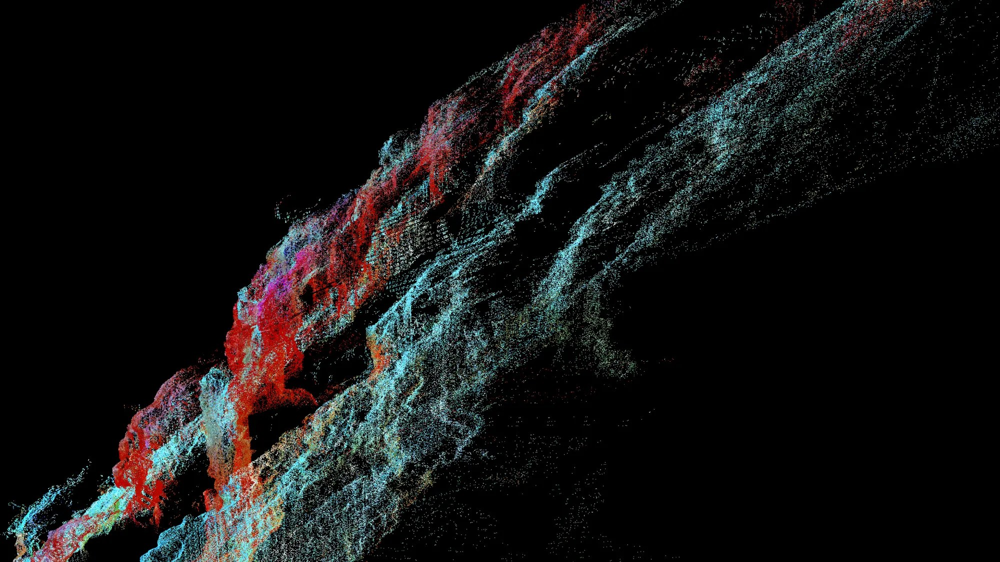

# MISHEARD CITY
### Edge AI as an Instrument of Urban Research

*Misheard City*

**B.Pro Intro Workshop · 5–16 October 2026 · Kunpeng Lei**

Misheard City investigates how **visual classification** shapes our perception and representation of urban life. When we train a model to recognise plants, infrastructure or weathered surfaces, we give particular details a place within our description of the city. The categories carry our interests; field encounters expose their limits and suggest other ways of seeing.

The workshop grows out of a **wearable visual-recognition device** developed and deployed in Venice, where classifications of the surroundings and bodily signals shaped a responsive soundscape. Over two weeks, each group develops its own enquiry through a **small device**, **field observations** and an **experimental film**. AI supports the reading of theoretical texts, programming, design and moving-image practice.

**No previous coding experience is required. All disciplinary backgrounds are welcome.** We work in four groups of four or five, with one Seeed Studio **XIAO ESP32S3 Sense** kit per group.

[Dates](#dates) · [Workshop modules](#workshop-modules) · [Support & resources](#support--resources)

# DATES

| Day | Date | Module | Topic | Time |
| --- | --- | --- | --- | --- |
| Introduction | Mon 05.10 | — | Project introduction and workshop selection | 10:25–10:35, online |
| **Day 1** | **Tue 06.10** | **1** | **Arduino and the XIAO: programming, AI-assisted iteration, image capture** | **09:30–13:00** |
| Day 2 | Thu 08.10 | 2 | Categories and datasets: image search, review, first training | 13:00–17:00 |
| Day 3 | Fri 09.10 | 2 | First model, deployment and field recording | 09:00–12:00 · 13:00–15:00 |
| Day 4 | Mon 12.10 | 3 | Fieldwork, enclosure design and optional sensors | 09:00–12:00 · 13:00–15:00 |
| Day 5 | Tue 13.10 | 3 | Data analysis, visualisation and AI-assisted moving image | 09:00–11:00 · 13:00–15:00 |
| Day 6 | Wed 14.10 | 4 | Film presentation 1: draft screenings | 09:00–13:00 |
| Day 7 | Thu 15.10 | 4 | Film presentation 2: revised screenings | 09:00–11:00 |
| Submission | Thu 15.10 | 4 | Final film | By 14:00 |
| Final presentation | Fri 16.10 | — | Screening of the workshop compilation | From 09:30 |

All times are London time. Teaching rooms will be announced separately.

# WORKSHOP MODULES

## Module 1: Programming and AI-assisted practice

We start with the **Arduino environment** and the **XIAO ESP32S3 Sense**: upload a program, change its behaviour, read serial messages and capture images. **AI-assisted coding** is a process of explaining, revising and checking: describe a small change, examine the suggested code and compare the result on the board.

### Day 1: Arduino and the XIAO ESP32S3 Sense

Each group introduces an interest in the city. We then program the board, make one change with AI assistance and save the first photographs to the microSD card. The **research task** for Day 2 is set at the end of the session.

[Introduction to Arduino](Day_01_Introduction/README.md) · [Camera and microSD](Day_01_Introduction/04_Camera_and_SD/README.md) · [Research task](Day_01_Introduction/05_Research/README.md)

## Module 2: Classification, datasets and edge AI

Develop a research question and a small set of **visual categories**. We collect candidate images through an **image-search API**, keep their sources and review them together: search results need judgement before they become training labels. With **Edge Impulse** we train a model and deploy it on the device, where classification decisions, ambiguous cases and errors become research material.

### Day 2: Categories and datasets

Groups present their proposals and refine their categories. We collect images with **Openverse** (or **Google Images** as an optional second source), review them in a **Python notebook** and export a dataset for Edge Impulse.

*Materials will be published here before the session on Thu 08.10.*

### Day 3: Model deployment and field recording

We complete a first model, run it on the XIAO and compare its readings with what we see. A **field recorder** saves each photograph together with its classification scores.

*Materials will be published here before the session on Fri 09.10.*

## Module 3: Devices, fieldwork and interpretation

Take the device into an urban setting and bring its records into dialogue with your observations. We introduce **enclosure design** with Rhino and AI assistance, **soldering** and **sensor recording**. Three **Grove GSR** sensors are available for optional experiments; a visual-only project is a complete enquiry. **Python notebooks** help organise and interpret the records: model scores, field descriptions and bodily signals are different kinds of evidence.

### Day 4: Fieldwork and device development

Groups review their first records, plan a second observation and design how the device is carried. Groups adding a sensor solder headers and test the GSR.

*Materials will be published here before the session on Mon 12.10.*

### Day 5: Data, storyboard and moving image

We analyse and visualise the field records in Python, develop the storyboard and try **AI-assisted image and video workflows**.

## Module 4: Moving image and discussion

Each group makes a **standalone film of approximately 3½–4 minutes**. It communicates the research question, the classification choices, something learned through the experiment and the group's artistic interpretation. Make the relationship between observations and generated imagery understandable; the film should work without a live presentation.

### Days 6–7: Film presentations

| Review | Bring | Discussion |
| --- | --- | --- |
| **14 October — Draft film** | A complete viewing draft; temporary sound, captions and marked placeholders are acceptable | Screening, a short account of the enquiry and class discussion |
| **15 October — Revised film** | The revised version and a brief note of the changes | The effect of the revisions and the remaining small edits |

**Submit the final film by 14:00 on 15 October**, with the group title, members' names and credits. The four films are screened together at the school presentation on 16 October.

# SUPPORT & RESOURCES

## GitHub

This repository is the **central access point** for all workshop materials: each lesson is a README page with its code, notebooks and images, published here before its session. Use **Code → Download ZIP** for a local copy, or [GitHub Desktop](https://desktop.github.com/) if you already use it.

Open `.ino` files in **Arduino IDE** and keep each sketch inside its matching folder. Python notebooks open in **Google Colab** or a local Jupyter installation; setup instructions come with the Day 2 materials. Keep your group's variations separate from the supplied examples, and note which code, data and model version produced each result.

## Readings

| Theme | Reading | Connection to the workshop |
| --- | --- | --- |
| Perception and position | Donna Haraway, [*Situated Knowledges*](https://commons.princeton.edu/hum583-f21/wp-content/uploads/sites/283/2021/08/Haraway-Situated-Knowledges.pdf), 1988 | The position and instruments through which an observation is made |
| Classification | Geoffrey C. Bowker and Susan Leigh Star, [*Sorting Things Out: Classification and Its Consequences*](https://mitpress.mit.edu/9780262024617/sorting-things-out/), 1999, introduction | The decisions and consequences involved in organising categories |
| Data and representation | Johanna Drucker, [*Humanities Approaches to Graphical Display*](https://digitalhumanities.org/dhq/vol/5/1/000091/000091.html), 2011 | How interpretation enters the construction and display of data |

## Resources

Software, documentation and image sources are listed on a separate [resources](Resources.md) page.
